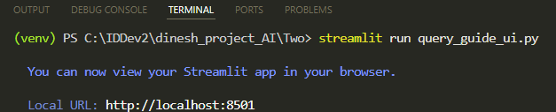
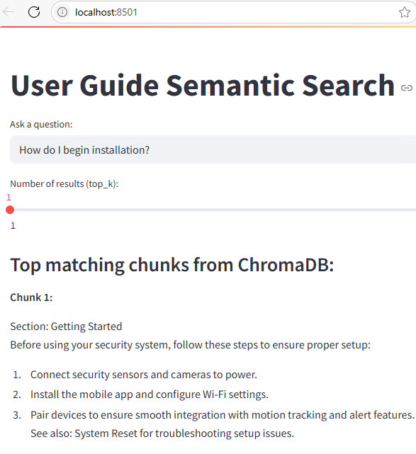
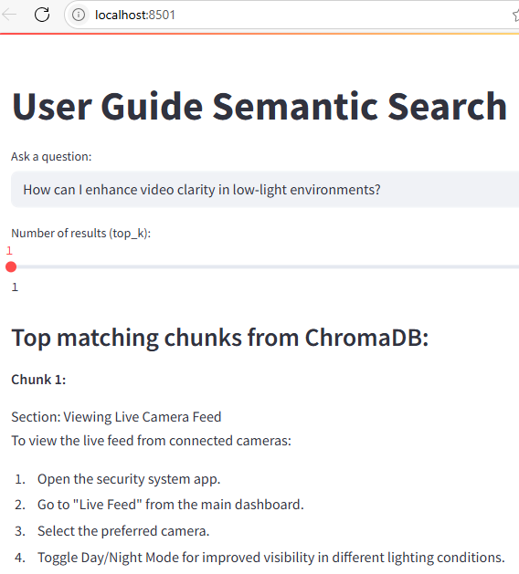
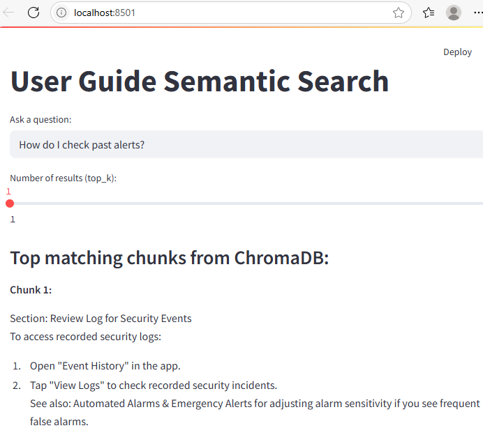
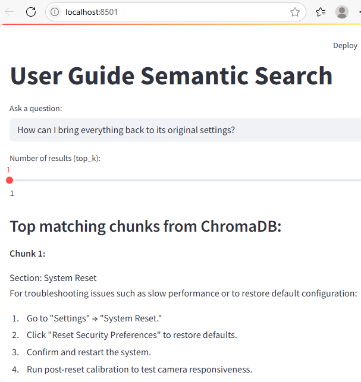
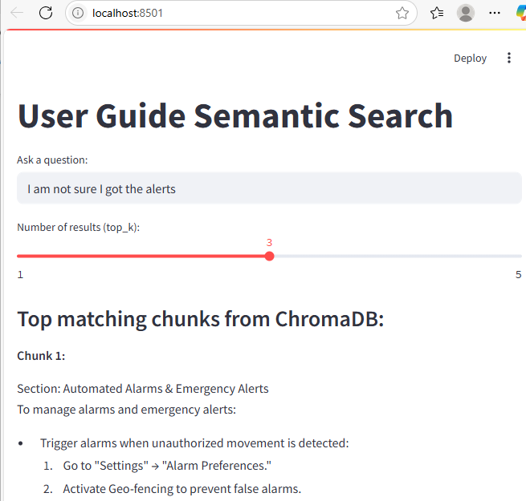
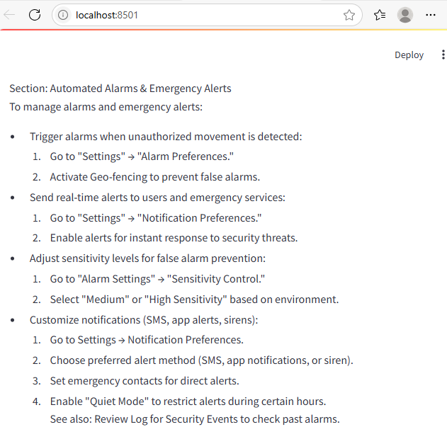
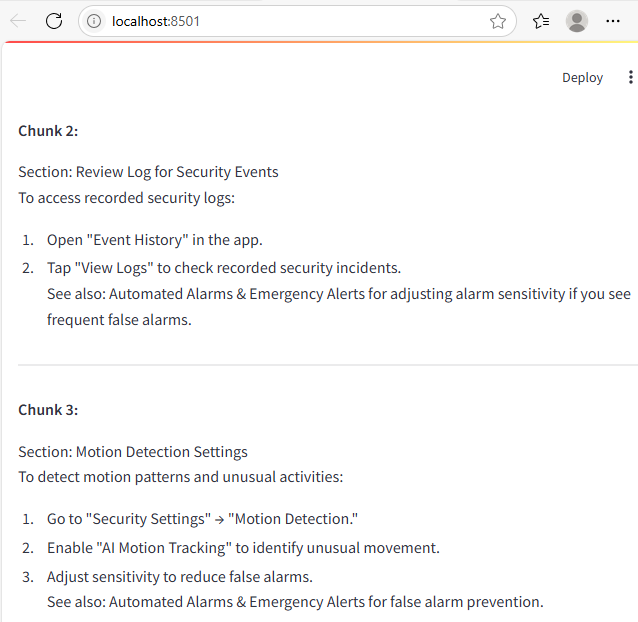
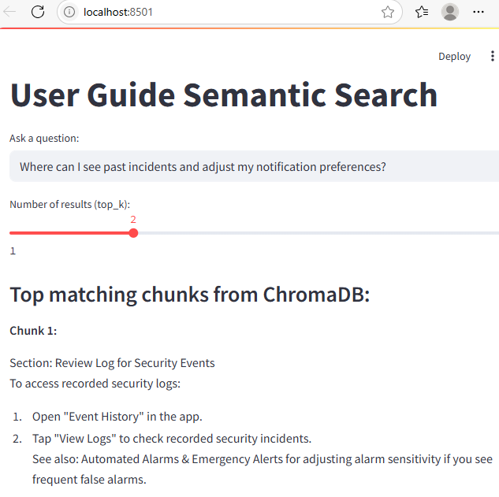
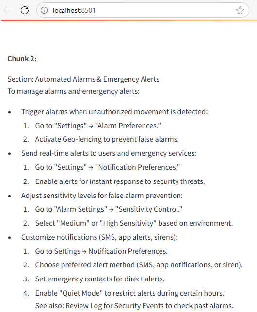

# Instant Answers from Documentation Using Gemini Embeddings and ChromaDB
Imagine users can simply ask a question and instantly receive the most relevant information from your product documentation. My objective was to build an application that searches a sample user guide and extracts the most relevant information. By combining Google Gemini's text embeddings with ChromaDB's vector storage, I wanted to create a semantic search engine for a sample user guide.

For the user interface, I used **Streamlit**, allowing users to easily type in questions and view instant answers directly in their browser.
Unlike traditional keyword search, this application relies on semantic search. That means it understands the meaning behind your questions and retrieves the most relevant sections, even if the wording doesn't match exactly.

---

## Chunking Strategy for the User Guide
To enable effective semantic search, I organized the user guide using a chunking strategy. Each section of the guide is separated by a custom marker, `===CHUNK===`. This allows the script to automatically split the guide into smaller, focused sections, each representing a distinct topic.

> **⬇️ Download the sample user guide as a zip file:**  
> [sample_user_guide.zip](sample_user_guide.zip)

By organizing the documentation in this way, each chunk can be individually embedded using Gemini and stored in ChromaDB. The main search is semantic: when a user asks a question, the application uses embeddings to find and retrieve the most relevant sections based on meaning, not just keywords.

This structure enables accurate retrieval from the user guide, making answers relevant.

## Building the Application
I created two Python scripts:

- Script 1: Reads and splits the sample user guide, generates semantic embeddings for each chunk using Gemini, and stores both the text chunks and their embeddings as records in ChromaDB. This prepares the data for semantic search.

- Script 2: Enables users to input questions, generates embeddings for their queries, and uses ChromaDB to retrieve and display the most relevant user guide sections based on semantic similarity rather than simple keyword matches. The user interface is built with Streamlit.

## User Interaction

Here's me running the second script to launch the UI:

{.screenshot-border}

This is our application with a search result:

{.screenshot-border}

We asked *How do I begin installation?* instead of *How do I set up the system*, and it still pulled the Getting Started section. This proves the application understands meaning, not just exact words.

Here's another example:

{.screenshot-border}

That result is a demonstration of **semantic search in action**. Even though our query didn't mention Day/Night Mode directly, it recognized that enhancing video clarity in low-light environments relates to adjusting camera settings for visibility.

Let's try another one:

{.screenshot-border}

Here, even if the exact phrase *past alerts* wasn't explicitly written in the guide, the application understood the meaning and pulled the relevant chunk.

Another one:

{.screenshot-border}

The query *How can I bring everything back to its original settings?* doesn't use direct phrases from the guide such as *System Reset*, *restore default configuration*, or *reset security preferences*. Yet, the application correctly displays the System Reset section, which precisely addresses restoring the system to its original settings.

We'll now set the relevant results to be returned to 3 and ask a broader question. This will retrieve multiple relevant results. Since the results page is long and its dynamic interface prevents a single scrolling screenshot, I've divided the output into multiple screenshots for clarity.

Screenshot 1:
Shows the top portion of the page, including the user question.

{.screenshot-border}

Screenshot 2:
Displays the middle section, with the first matching chunk.

{.screenshot-border}

Screenshot 3:
Captures the remaining results.

{.screenshot-border}

- Chunk 1: *Automated Alarms & Emergency Alerts* directly addresses how alerts are managed and customized, which is the most relevant for users unsure about receiving alerts.

- Chunk 2: *Review Log for Security Events* guides users to check the event history, helping confirm if any alerts or incidents were recorded, which is a logical next step if someone is unsure about receiving notifications.

- Chunk 3: *Motion Detection Settings* while less directly related, it's relevant because motion detection settings can influence whether alerts are triggered in the first place (for example, if sensitivity is low, fewer alerts will be generated).

This demonstrates that the application is retrieving the most contextually relevant chunks, not just matching keywords, and is displaying all sections a user might need to troubleshoot or understand alert issues.

Final one. When we ask, *Where can I see past incidents and adjust my notification preferences?*, the application returns:

- Review Log for Security Events (for viewing past incidents)

- Automated Alarms & Emergency Alerts (for adjusting notification preferences)

Screenshot 1:
Shows the top portion of the results, including the user question and the first matching chunk.

{.screenshot-border}

Screenshot 2:
Displays the remaining result.

{.screenshot-border}

This shows that it's correctly understanding the intent behind a multi-part, natural language question and displaying the most relevant chunks.

## Conclusion
The search is not perfect, but it works effectively when we ask relevant questions from the guide. It performs the **retrieval** step using **embeddings** and **ChromaDB**, but does not perform the **augmented generation** step with an **LLM**. 

The [next post](../notes2/RAG_guide_demo.md){target="_blank"} outlines how I integrated an LLM to create a true RAG (Retrieval-Augmented Generation) system, which will improve synthesis of multiple chunks and provide more natural language responses.