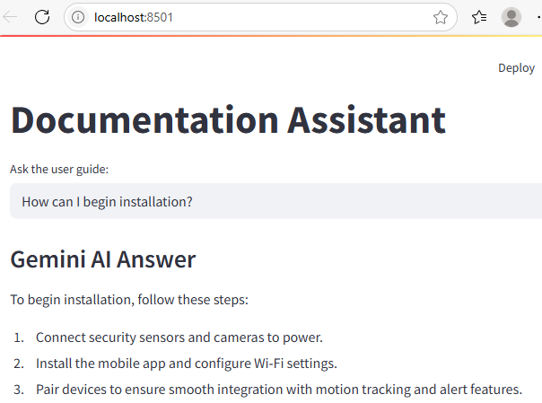

# Instant Answers from Documentation Using RAG
In the [previous demo](../notes1/semantic_search_demo.md){target="_blank"}, we split the user guide into logical chunks. For each chunk, we used Gemini's *text-embedding-004* model to generate an embedding vector, and stored both the chunks and their embeddings in ChromaDB. When a user asked a question, the application generated an embedding for the question using the same Gemini model, queried ChromaDB with this embedding, and displayed the most relevant retrieved chunks to the user. This process enabled semantic search, allowing the application to answer based on the meaning of the question rather than just keyword matching.

---

## Taking it to the Next Level
I have now enhanced the application to use Gemini LLM: 

This is a classic Retrieval-Augmented Generation (RAG) pipeline:

**User question → Gemini Embedding → ChromaDB similarity search → Retrieve top chunks → Gemini LLM for answer**.

By integrating Gemini LLM into the workflow, the application not only makes answers more conversational but also improves accuracy and relevance. The LLM synthesizes information from multiple retrieved chunks, filters out irrelevant details, and generates context-aware responses for the user's question. This approach reduces hallucinations, ensures answers are grounded in your guide, and enables the application to handle complex or ambiguous queries more effectively, delivering a better overall user experience.

⚡Important:
In my implementation, I have instructed the LLM to answer only using the information found in the retrieved context (chunks from ChromaDB). If the answer is not present in the guide, the LLM is prompted to respond: *I couldn’t find the answer. You can post your question in our product forum*. This ensures the application does not hallucinate or provide unsupported answers.

## User Interaction

Running the second script to initiate the UI:

{.screenshot-border}

Here's our application featuring a search result:

{.screenshot-border}

The application with use of AI reads the most relevant chunks, understands the question in context, and synthesizes a clear, direct answer.

Another demonstration of this:

{.screenshot-border}

Instead of just showing raw chunks from the user guide, the AI reads and understands the user's question, then synthesizes a clear, direct answer.

A further example:

{.screenshot-border}

Here again, users get a quick, actionable response without having to sift through multiple guide sections.

Here's another one with a multi-part question:

{.screenshot-border}

The application understands the full question, gathers the necessary details from across the guide, and presents them in a clear, actionable format.

A different question to consider:

{.screenshot-border}

The application interprets the user's intent and gives the exact steps the user needs.

A question that's not covered in the guide:

{.screenshot-border}

The *I couldn't find the answer* response is a sign that the application is working as intended, giving helpful answers when possible, and gracefully handling questions outside the scope of the documentation.

Finally, a comparative question:

{.screenshot-border}

The AI application doesn't just repeat the guide. It interprets, compares, and explains, so users get a clear understanding of two different features. This is more helpful than reading through separate sections and trying to compare them on their own.

## Conclusion
The semantic search pipeline, which uses Gemini text embeddings and ChromaDB, identifies the most relevant information from the documentation. By introducing an LLM into this pipeline, the application has enhanced the quality of answers provided to users. Instead of simply returning guide sections, it now uses AI to understand the question with the context identified by semantic search and generate a clear, actionable response.

