# Getting Started with Python
In this guide, we'll go over the basics of Python. We'll cover how to set up your Windows environment, run your first Python file, and learn important concepts like comments, variables, conditional statements (if else and else if), loops (for and while), and functions. Let's get started!

---

## How to Set Up the Windows Environment

To being developing with Python on Windows, you'll need to install:

1. Python: [https://www.python.org/downloads/](https://www.python.org/downloads/)
    
2. Visual Studio Code (VS Code): [https://code.visualstudio.com/](https://code.visualstudio.com/)
    
3. VS Code Extension for Python: [https://marketplace.visualstudio.com/items?itemName=ms-python.python](https://marketplace.visualstudio.com/items?itemName=ms-python.python)
    

## Create and Run Your First Python File

Step 1: Open VS Code. Create a new Python file:

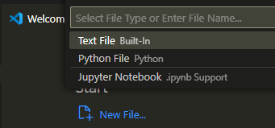

Step 2: Copy and paste this code into the file:

```python
print ("Hello world")
Item = "Rain"
item = "Thunder"
print (item + ' ' + Item)
```

This code is using:

- `print` function to display text. A function is a block of code that runs when it's called.
- Variables `Item` and `item` to store strings *Rain* and *Thunder*.
    

> 💡 **Tip:** Variables are case sensitive. <code>Item</code> and <code>item</code> are two different variables.

Step 3: Click **Run**:

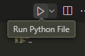

Here's what you'll see when you run the file:

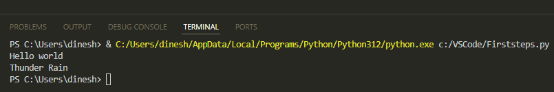

## Comments

Add comments to clarify your code. Python will not execute the comments. You can add a comment by adding *#* at the start of the line.

Step 1: Replace the previous content of your file with this code:

```python
# Greet the user
print("Hi there!")
```

Step 2: Click **Run**.

Here's what you'll see:

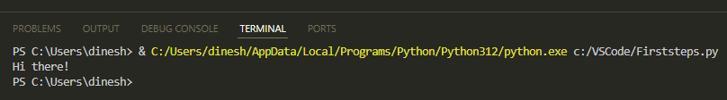

## Variables

Earlier, we used two variables `Item` and `item` to store string values. Let's now use variables to store numbers and numeric calculations.

Step 1: Replace the previous content of your file with this code:

```python
a = 20
b = 5
addition = a + b
subtraction = a - b
multiply = a * b
division = a / b
print (addition)
print (subtraction)
print (multiply)
print (division)
```

The code is using variables `a` and `b` to store numbers and then variables `addition`, `subtraction`, `multiply`, and `division` to store the calculations.

Step 2: Click **Run**.

Here's what you'll see:

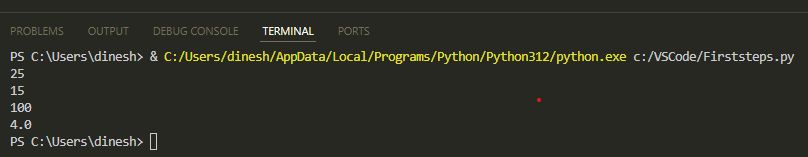

## If Else

Use *If Else* for defining conditions and then executing the code based on the conditions.

Step 1: Replace the previous content of your file with this code:

```python
item_available = True
if item_available is False:
    print ("The item isn't available")
else:
    print ("The item is available")
isCollegeOpen = True
if isCollegeOpen:
    print ("The college is open")
else:
    print ("The college is closed")
```

The code is using Boolean variables. A Boolean variable can contain a value of `True` or `False`.

Step 2: Click **Run**.

Here's what you'll see:

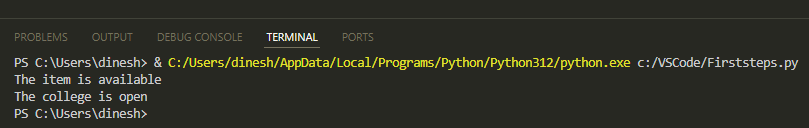

## Else If

`elif` lets you handle multiple conditions. `elif` stands for else if.

Step 1: Replace the previous content of your file with this code:

```python
selected_color = "yellow"
if selected_color == "blue":
    print("Blue means calmness.")
elif selected_color == "yellow":
    print("Yellow means joy and happiness.")
elif selected_color == "green":
    print("Green means freshness.")
else:
    print("That's a nice color!")
```

`else` catches any condition that's not caught by `if` and `elif`.

Step 2: Click **Run**.

Here's what you'll see:

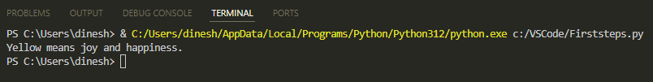

## For Loop

*For* loop repeats actions for each item in a sequence.

Step 1: Replace the previous content of your file with this code:

```python
sport_list = ["hockey", "soccer", "basketball"]
for sport in sport_list:
    print (sport)
```

The code is looping through the list items using a *for* loop.

Step 2: Click **Run**.

Here's what you'll see:


## While Loop

*While* loop repeats actions as long as the condition is true. Once the condition is false, it stops.

Step 1: Replace the previous content of your file with this code:

```python
b = 10
while b < 15:
    b = b + 1
    print (b)
```

The code initializes `b` to 10 and enters a *while* loop that continues as long as `b` is less than 15. During each loop iteration, `b` is incremented by 1, and the new value of `b` is printed.

Step 2: Click **Run**.

Here's what you'll see:

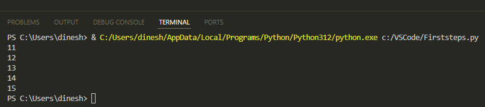

## Functions

Function is the block of code that runs when it’s called. Define it by using the `def` keyword. A function can have one or more parameters or none.

Step 1: Replace the previous content of your file with this code:

```python
def guess_fruit():
    while True:
        user_value = input("Enter the fruit I like most: ")
        if user_value == "apple":
            print("That's correct!")
            break
        else:
            print("Nope, that's not the fruit I like. Try again.")
guess_fruit()
```

The last line calls the function. The function keeps prompting the user to enter the correct value until the guess is correct.

The code uses the `break` keyword to break out of the *while* loop.

Step 2: Click **Run**.

Here's what you'll see:

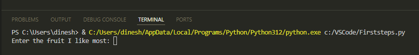

Step 3: Enter *orange*. The program will prompt you to try again until the correct answer is entered:

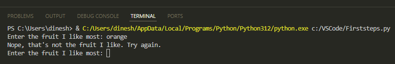

Step 4: This time enter *apple*. The program will respond with *That’s correct!*:

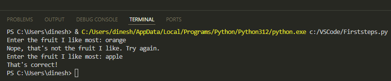

Now that you know the basics like variables, loops, and functions, you're ready to dive deeper into the world of Python. Happy coding!

---