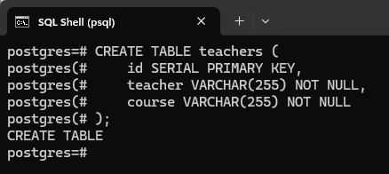
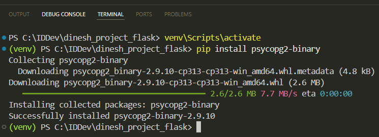
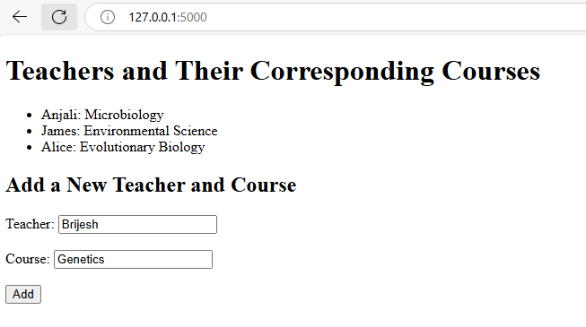
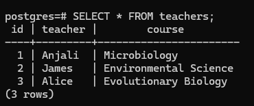

# Building a Dynamic Web Page with Flask and PostgreSQL

Using the [Getting Started with Flask](../doc8/Flask_Intro.md){target="_blank"} document, we created a Flask application that collects teacher and course names from users and displays these names. The application stored this information in a JSON file.

This document guides you on how to use PostgreSQL instead of a JSON file for storing and retrieving the teacher and course names. PostgreSQL is a database system that uses SQL. You can download and install PostgreSQL from the official website: [https://www.postgresql.org/download/windows/](https://www.postgresql.org/download/windows/){target="_blank"}

Use the same Flask environment in Windows that we used in the [Getting Started with Flask](../doc8/Flask_Intro.md){target="_blank"} document.

---

## Create the Database Table
Connect to the PostgreSQL database and create a table. To create the table, you can use this command in the SQL shell:

```pgsql
postgres=# CREATE TABLE teachers (
postgres(#     id SERIAL PRIMARY KEY,
postgres(#     teacher VARCHAR(255) NOT NULL,
postgres(#     course VARCHAR(255) NOT NULL
postgres(# );
```

If everything goes well, you should see the `CREATE TABLE` message like this:



## Set Up the PostgreSQL Connection
Step 1: Activate the virtual environment in the Visual Studio Code (VS Code) terminal by typing the command: `venv\Scripts\activate`

Step 2: Use the `pip` command to install *psycopg2* to connect to your PostgreSQL database from Flask: `pip install psycopg2-binary`



Psycopg2 is a popular PostgreSQL database connector for Python.

Step 3: There are several ways to store sensitive information. For now, we will store the database username and password in environment variables and access them from the application.

Type the following commands in the VS Code terminal (PowerShell):

```powershell
$env:DB_USER="your_db_username"
$env:DB_PASSWORD="your_db_password"
```

You'll need to replace `your_db_username` and `your_db_password` with your actual database username and password.

Note that the environment variables set using these commands are temporary and will be lost when you close the terminal or deactivate the virtual environment.

## Update the Flask Application to Use PostgreSQL

Update your Flask application to use PostgreSQL instead of JSON:

* Import the necessary libraries and establish a connection to the PostgreSQL database.
    
* With the switch to using a PostgreSQL database, we no longer need the `json` module, as we're not working with JSON files anymore. You can safely remove the `import json` line from your code.
    
* The `load_teachers` function fetches teacher and course information from the PostgreSQL database.
    
* The `save_teacher` function inserts a teacher and course record into the database.
    
Here's the updated code for the application:

```python
import os
import psycopg2
from flask import Flask, render_template, request

app = Flask(__name__)

# Function to establish a connection to the PostgreSQL database
def connect_db():
    conn = psycopg2.connect(
        dbname="postgres",
        user=os.getenv("DB_USER"),
        password=os.getenv("DB_PASSWORD"),
        host="localhost",
        port="5432"
    )
    return conn

# Function to load teacher and course names from the PostgreSQL database
def load_teachers():
    conn = connect_db()
    cur = conn.cursor()
    cur.execute("SELECT teacher, course FROM teachers")
    rows = cur.fetchall()
    conn.close()
    return {row[0]: row[1] for row in rows}

# Function to save a teacher name and the corresponding course name to the PostgreSQL database
def save_teacher(teacher, course):
    conn = connect_db()
    cur = conn.cursor()
    cur.execute("INSERT INTO teachers (teacher, course) VALUES (%s, %s)", (teacher, course))
    conn.commit()
    conn.close()

# Load initial data
teachers_dict = load_teachers()

@app.route('/', methods=['GET', 'POST'])
def home():
    if request.method == 'POST':
        teacher = request.form['teacher']
        course = request.form['course']
        save_teacher(teacher, course)
        teachers_dict[teacher] = course
    return render_template('home.html', teachers=teachers_dict)

if __name__ == '__main__':
    app.run(debug=True)
```

The `load_teachers` function:

* Connects to the PostgreSQL database using the `connect_db()` function.
    
* Runs an SQL query to retrieve the teacher and course information.
    
* Fetches the results as a list of tuples and transforms them into a dictionary. For example, in a list `[('Anjali', 'Microbiology'), ('James', 'Environmental Science')]`, `row[0]` will be `'Anjali'` for the first tuple and `'James'` for the second tuple. `row[1]` will be `'Microbiology'` for the first tuple and `'Environmental Science'` for the second tuple.
    
* Closes the database connection.
    
The `save_teacher` function:

* Uses the `connect_db()` function to establish a connection to the PostgreSQL database.
    
* Runs an SQL INSERT statement to add the teacher and course pair into the `teachers` database table.
    
* Commits the transaction to ensure the changes are saved to the database.
    
* Closes the database connection.
    

The `home` function is called when the user accesses the web page. When a new teacher and course are added, the function passes these values to the `save_teacher` function to insert them into the database table. The `home` function then updates the `teachers_dict` dictionary and returns the updated dictionary to be displayed on the web page.

> 💡 **Tip:** The `home.html` file we created using the [Getting Started with Flask](../doc8/Flask_Intro.md){target="_blank"} document will remain in the `templates` directory.

## Run the Flask Application
Run the application and test the web page as discussed in the *Run the Application* section of the [Getting Started with Flask](../doc8/Flask_Intro.md){target="_blank"} document.

For example, you should now be able to add teachers and courses on the web page:



You can also verify that the data has been successfully inserted into the database by running the select query in the SQL shell:



Congratulations! You've learned how to build a dynamic web page using Flask and store the added information in PostgreSQL for data persistence.
