# Building a REST API with Flask-RESTx and Swagger Documentation
Using this document, we'll create a simple REST API to manage contacts. The API will include fields for name, email, and a subscription indicator to track whether a contact has subscribed to our newsletter. We'll use Flask-RESTx, which can automatically generate Swagger documentation for this API. The documentation will make it easier for developers to understand and interact with the API endpoints.

The API will cover the following operations:

* **GET** requests to retrieve contact information
    
* **POST** requests to add new contacts
    
* **PUT** requests to update existing contact details
    
* **DELETE** requests to remove contacts
    
---

## Set Up the Flask Environment in Windows

You can use the same environment that you used for [Building Your First REST API Using Flask](../doc9/First_REST_API_Flask.md){target="_blank"}.

If the virtual environment isn't activated, activate it and install Flask-RESTx by typing the command: `pip install flask-restx`

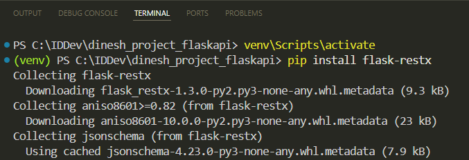

## Create the Flask Application

<span class="step-number">1</span> Create a file named `contacts.py`.

<span class="step-number">2</span> Import necessary components and create an instance of the Flask class:

```python
from flask import Flask, request
from flask_restx import Api, Resource, fields

app = Flask(__name__)
```

<span class="step-number">3</span> Initialize the Flask-RESTx API:

```python
api = Api(app, version='1.0', title="Dinesh's Contact Management API", description='Add, see, update, and remove your contacts.')
```

<span class="step-number">4</span> Define a namespace for the API:

```python
ns = api.namespace('contacts', description='Contact operations')
```

* `ns`: This is a variable that stores the namespace instance. You can name this variable anything you like.
    
* `api.namespace('contacts', ...)`: This method creates a namespace with the path `contacts`. This means all endpoints defined under this namespace will be prefixed with `/contacts`.
    
A namespace helps organize your API endpoints under a common group, making it easier to manage and document them. Additionally, namespaces improve the auto-generated Swagger documentation by categorizing endpoints.

<span class="step-number">5</span> Define the contact model:

```python
contact_model = api.model('Contact', {
    'id': fields.Integer(readOnly=True, description='The contact unique identifier.'),
    'name': fields.String(required=True, description='The contact name.'),
    'email': fields.String(required=True, description='The contact email.'),
    'subscribed': fields.Boolean(description='Indicates whether the contact is subscribed to promotional messages. Valid values are true or false.')
})
```

When you define this model in Flask-RESTx, it automatically includes this model in the Swagger documentation, making it clear what kind of data your endpoints expect.

<span class="step-number">6</span> Create an empty list to store contacts temporarily:

```python
contacts = []
```

<span class="step-number">7</span> Define the `ContactList` resource and its endpoints:

```python
@ns.route('/')
class ContactList(Resource):
    @ns.doc('list_contacts', description='Retrieves a list of all contacts.')
    @ns.marshal_list_with(contact_model)
    def get(self):
        return contacts

    @ns.doc('create_contact', description='Creates a new contact.')
    @ns.expect(contact_model)
    @ns.marshal_with(contact_model, code=201)
    def post(self):
        new_contact = api.payload
        new_contact['id'] = len(contacts) + 1
        contacts.append(new_contact)
        return new_contact, 201
```

* This resource has two main methods: `get` (retrieves the full list of contacts) and `post` (adds a new contact to the list).
    
* The `ns.doc` decorator adds descriptions to the `get` and `post` operations, enhancing the auto-generated documentation.
    
* The `ns.marshal` decorator specifies that the output will be in the format defined by the `contact_model`.
    
* `ns.expect` specifies that the request body must follow the `contact_model`, ensuring that the incoming data matches the defined schema.
    

<span class="step-number">8</span> Define the `Contact` resource and its endpoints:

```python
@ns.route('/<int:id>')
@ns.response(404, 'Contact not found')
@ns.param('id', 'The contact identifier')
class Contact(Resource):
    @ns.doc('get_contact', description='Retrieves the contact information by contact ID.')
    @ns.marshal_with(contact_model)
    def get(self, id):
        for contact in contacts:
            if contact['id'] == id:
                return contact
        api.abort(404)

    @ns.doc('delete_contact', description='Deletes the contact by contact ID.')
    @ns.response(204, 'Contact deleted')
    def delete(self, id):
        global contacts
        contacts = [contact for contact in contacts if contact['id'] != id]
        return '', 204

    @ns.doc('update_contact', description='Updates the contact information by contact ID.')
    @ns.expect(contact_model)
    @ns.marshal_with(contact_model)
    def put(self, id):
        for contact in contacts:
            if contact['id'] == id:
                contact.update(api.payload)
                return contact
        api.abort(404)
```

This resource has three main methods: `get` (retrieves the contact information by contact ID), `delete` (deletes the contact by contact ID), and `put` (updates the contact information by contact ID).

<span class="step-number">9</span> Add the namespace to the API to ensure that endpoints, such as `GET /contacts`, can be accessed through the API:

```python
api.add_namespace(ns)
```

<span class="step-number">10</span> Ensure that the Flask application will start running with debug mode enabled when you run the `contacts.py` file:

```python
if __name__ == '__main__':
    app.run(debug=True)
```

## Run the Application

On Visual Studio Code, click **Run** for `contacts.py`. This will launch the server locally:

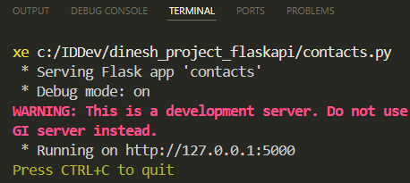

## Access and Review the Swagger Documentation

Once the server is running, you can access the automatically generated Swagger documentation by navigating to `http://127.0.0.1:5000/` in your web browser.

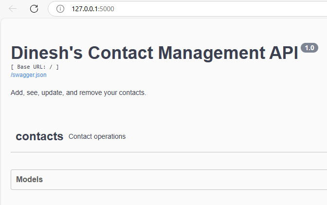

Click **Models**, then **Contact**: The expanded view will show you the fields that make up the model, along with their data types and descriptions.


Expand **Contacts** to see all the API endpoints, such as **GET /contacts**:

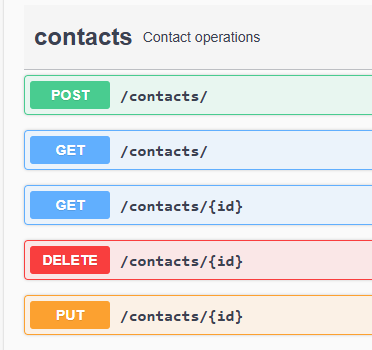

Click on the desired endpoint to expand it. For example, click on **POST /contacts** to see the post operation's description and example of the JSON object that you can send:

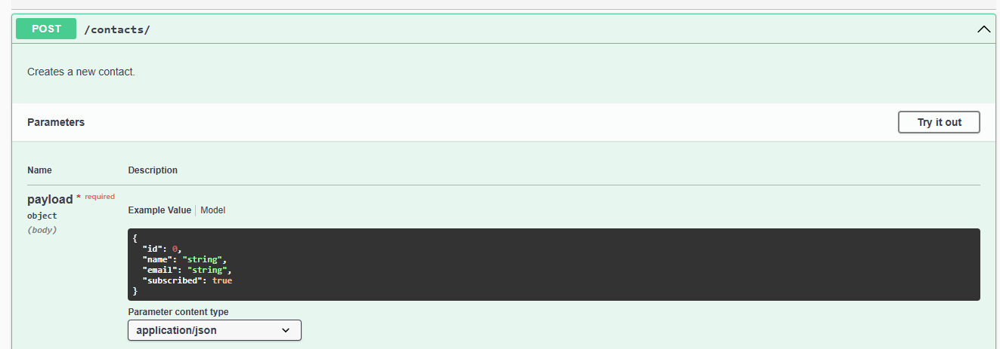

You can also see the example response:

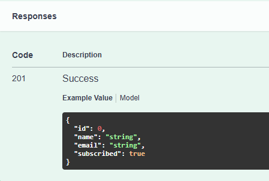

### Try it Out

You can use the *Try it out* feature in the Swagger documentation for all operations. This feature allows you to interact with the API directly from the documentation interface. Let's add a contact:

<span class="step-number">1</span> Click **Try it out** for the post operation. You'll see fields where you can enter data.

<span class="step-number">2</span> Add the contact details in the Payload field:

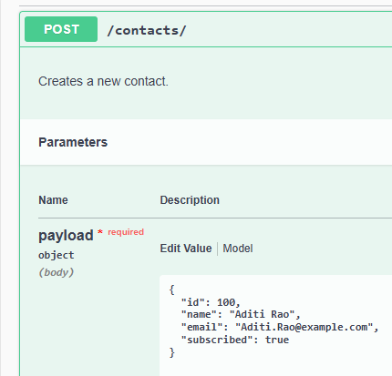

<span class="step-number">3</span> Click **Execute**.

If successful, you'll get a 201 status code along with the details of the newly created contact:

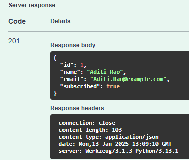

<span class="step-number">4</span> Add another contact by repeating steps 1 to 3, entering the new contact's details in the Payload field, and executing the request again:

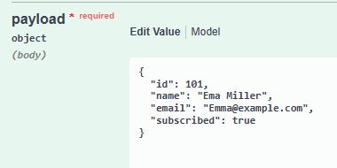

<span class="step-number">5</span> Expand the **GET /contacts** endpoint:

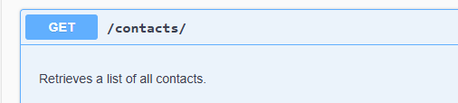

<span class="step-number">6</span> Click **Try it out** for the get operation.

<span class="step-number">7</span> Click **Execute** to send a request to the endpoint.

The response body will display the data retrieved by the `GET /contacts` operation, showing the information for both added contacts and indicating a `200` status code:

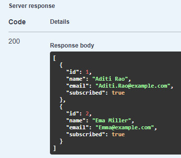

The `200` status indicates that the request was successful, and the server has returned the requested data.

<span class="step-number">8</span> Let's say you want to update email from `Emma@example.com` to `Emma.Miller@example.com`. Expand the **PUT /contacts/{id}** endpoint.

<span class="step-number">9</span> Click **Try it out**.

<span class="step-number">10</span> Enter the ID of the contact whose email you want to change:

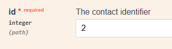

<span class="step-number">11</span> In the request body, enter the new email address along with any other details you want to keep unchanged:

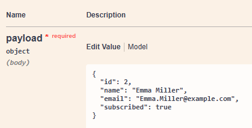

<span class="step-number">12</span> Click **Execute**.

The response body will show the updated contact information, and you'll receive a `200` status code indicating that the update is successful:

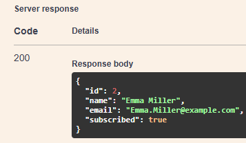

Nicely done! By using this document, we successfully created a Contact Management API using Flask-RESTx that handles GET, POST, PUT, and DELETE requests. We also auto-generated Swagger documentation that provides information about the API and allows users to interact with the API.
