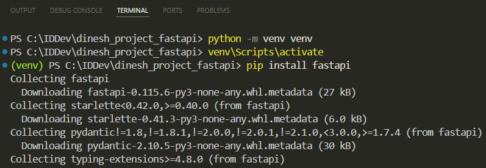
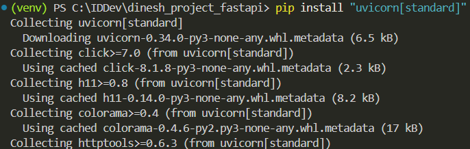
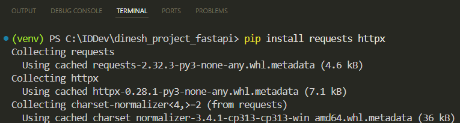
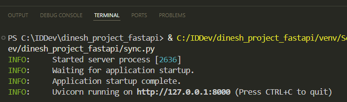
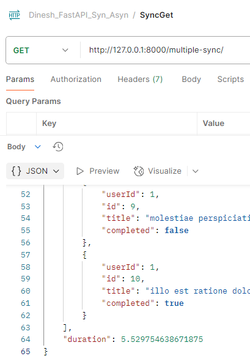
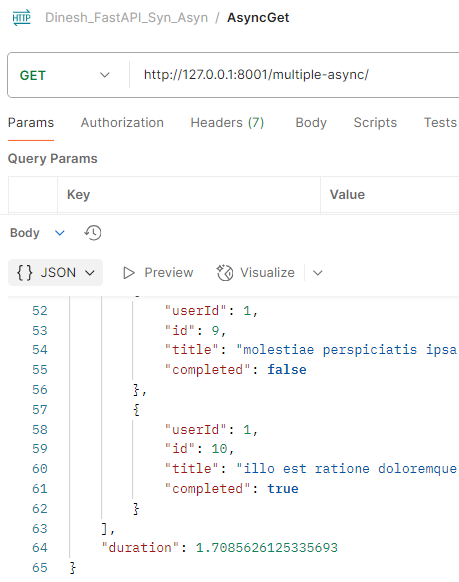

# FastAPI Performance: Comparing Sync and Async Endpoints
FastAPI is a Python-based framework designed to build APIs. We'll install FastAPI and explore the benefits of asynchronous programming, which allows tasks to be handled concurrently, leading to more efficient response times. By creating both synchronous and asynchronous endpoints, we'll test and compare their performance.

---

## Set Up the FastAPI Environment in Windows

<span class="step-number">1</span> Open the terminal in Visual Studio Code and type: `python -m venv venv`

This creates a virtual environment. Using virtual environments ensures that the dependencies for one project don't interfere with the dependencies of other projects.

<span class="step-number">2</span> Activate the virtual environment: `venv\Scripts\activate`

<span class="step-number">3</span> Once the virtual environment is activated, you can install FastAPI using this command: `pip install fastapi`



<span class="step-number">4</span> FastAPI requires an ASGI server to run, such as Uvicorn. You can install it with: `pip install "uvicorn[standard]"`



ASGI (Asynchronous Server Gateway Interface) is a specification for building and running web applications in Python that support asynchronous programming. It allows for handling multiple tasks concurrently, making it ideal for high-performance applications.

<span class="step-number">5</span> To install the necessary libraries for our synchronous and asynchronous scripts, use the following command: `pip install requests httpx`



## Create a Synchronous Endpoint with FastAPI

<span class="step-number">1</span> Create a file named `sync.py`.

<span class="step-number">2</span> Import the necessary components:

```python
from fastapi import FastAPI
import requests
import time
```

* `FastAPI`: Framework for creating the API.
    
* `requests`: For making HTTP requests.
    
* `time`: For measuring the duration of processing.
    

<span class="step-number">3</span> Create the FastAPI instance:

```python
app = FastAPI()
```

<span class="step-number">4</span> Define the `fetch_data` function:

```python
def fetch_data(url):
    response = requests.get(url)
    return response.json()
```

`fetch_data(url)`: Makes an HTTP GET request to the specified URL and returns the JSON response.

<span class="step-number">5</span> Create the synchronous endpoint:

```python
@app.get("/multiple-sync/")
def multiple_sync():
    urls = [
        "https://jsonplaceholder.typicode.com/todos/1",
        "https://jsonplaceholder.typicode.com/todos/2",
        "https://jsonplaceholder.typicode.com/todos/3",
        "https://jsonplaceholder.typicode.com/todos/4",
        "https://jsonplaceholder.typicode.com/todos/5",
        "https://jsonplaceholder.typicode.com/todos/6",
        "https://jsonplaceholder.typicode.com/todos/7",
        "https://jsonplaceholder.typicode.com/todos/8",
        "https://jsonplaceholder.typicode.com/todos/9",
        "https://jsonplaceholder.typicode.com/todos/10"
    ]
    
    start_time = time.time()
    results = [fetch_data(url) for url in urls]
    end_time = time.time()
    
    return {"results": results, "duration": end_time - start_time}
```

The code:

* Defines an endpoint `/multiple-sync/`.
    
* Defines a list of URLs to fetch data from.
    
* Captures the start time.
    
* Loops through the URLs and fetches data synchronously using the `fetch_data` function.
    
* Captures the end time.
    
* Returns the fetched results and the total duration taken to process the requests.
    

The `fetch_data` function performs the requests one at a time in a blocking manner. This means each request is completed before the next one starts. The line `results = [fetch_data(url) for url in urls]` calls `fetch_data` in each iteration of the loop, gets the JSON response for each request, stores it in `results`, then moves to the next request.

**JSONPlaceholder** is a free online REST API that you can use for testing and prototyping. These URLs in our code are endpoints provided by JSONPlaceholder, each returning a JSON object representing a to-do item.

<span class="step-number">6</span> Run the FastAPI application:

```python
if __name__ == "__main__":
    import uvicorn
    uvicorn.run(app, host="127.0.0.1", port=8000)
```

## Create an Asynchronous Endpoint with FastAPI

<span class="step-number">1</span> Create a file named `async.py`.

<span class="step-number">2</span> Import the necessary components:

```python
from fastapi import FastAPI
import httpx
import asyncio
import time
```

* **FastAPI**: Framework for creating the API.
    
* **httpx**: For making asynchronous HTTP requests.
    
* **asyncio**: For writing concurrent code using `async` and `await` keywords.
    
* **time**: For measuring the duration of processing.
    

<span class="step-number">3</span> Create the FastAPI instance:

```python
app = FastAPI()
```

<span class="step-number">4</span> Define the asynchronous data fetching function:

```python
async def fetch_data(client, url):
    response = await client.get(url)
    return response.json()
```

This function takes an HTTP client and a URL, sends a GET request to the URL, and returns the JSON response.

* `async def` keyword defines an asynchronous function.
    
* `client.get(url)` sends an HTTP GET request to the specified URL. The `await` keyword allows the function to pause and wait for the response while other tasks continue to execute concurrently. For example, while one `fetch_data` call is waiting for a response from an HTTP GET request, another `fetch_data` call can send another HTTP request.
    

<span class="step-number">5</span> Create the asynchronous endpoint:

```python
@app.get("/multiple-async/")
async def multiple_async():
    urls = [
        "https://jsonplaceholder.typicode.com/todos/1",
        "https://jsonplaceholder.typicode.com/todos/2",
        "https://jsonplaceholder.typicode.com/todos/3",
        "https://jsonplaceholder.typicode.com/todos/4",
        "https://jsonplaceholder.typicode.com/todos/5",
        "https://jsonplaceholder.typicode.com/todos/6",
        "https://jsonplaceholder.typicode.com/todos/7",
        "https://jsonplaceholder.typicode.com/todos/8",
        "https://jsonplaceholder.typicode.com/todos/9",
        "https://jsonplaceholder.typicode.com/todos/10"
    ]
    
    start_time = time.time()
    async with httpx.AsyncClient() as client:
        tasks = [fetch_data(client, url) for url in urls]
        results = await asyncio.gather(*tasks)
    end_time = time.time()
    
    return {"results": results, "duration": end_time - start_time}
```

* Defines a GET endpoint `/multiple-async/` that will handle asynchronous requests.
    
* Creates a list of URLs to fetch data from.
    
* Records the start time to measure the duration of processing.
    
* Creates an asynchronous HTTP client using `httpx.AsyncClient`.
    
* Creates a list of tasks to fetch data from each URL concurrently.
    
* `await asyncio.gather(*tasks)` runs all the tasks concurrently and waits for them to complete, collecting the results.
    
* Records the end time and calculates the duration of the operation.
    
* Returns the fetched results and the duration.
    

In summary:

1. `async def fetch_data(client, url)`**:** Makes the individual requests asynchronous, allowing them to run concurrently.
    
2. `async with httpx.AsyncClient() as client`**:** Ensures that all client requests are handled asynchronously.
    
3. `tasks = [fetch_data(client, url) for url in urls]` **and** `await asyncio.gather(*tasks)`**:** Runs all tasks concurrently, collecting all the responses once they're all completed.
    

These components work together to make your application handle multiple HTTP requests concurrently.

<span class="step-number">6</span> Run the FastAPI application:

```python
if __name__ == "__main__":
    import uvicorn
    uvicorn.run(app, host="127.0.0.1", port=8001)
```

## Test the Synchronous and Asynchronous Endpoints

We'll test the endpoints using Postman.

### Testing the Synchronous Endpoint

<span class="step-number">1</span> Run `sync.py`.



<span class="step-number">2</span> In Postman, add a new GET request. I created a collection *Dinesh\_FastAPI\_Syn\_Asyn* and added a new request. Enter the URL for your synchronous endpoint: `http://127.0.0.1:8000/multiple-sync/`


<span class="step-number">3</span> Click **Send**. You can find the response time in milliseconds (ms) just below the response body:



For me, the total time taken was **5.53 seconds**.

### Testing the Asynchronous Endpoint

<span class="step-number">1</span> Run `async.py`.


<span class="step-number">2</span> In Postman, add a new GET request. Enter the URL for your asynchronous endpoint: `http://127.0.0.1:8001/multiple-async/`


<span class="step-number">3</span> Click **Send**. You can find the response time in milliseconds (ms) just below the response body:



For me, the total time taken was **1.71 seconds**.

Comparing both:

* **Synchronous Duration:** 5.53 seconds
    
* **Asynchronous Duration:** 1.71 seconds
    

As you can see, the asynchronous endpoint (/multiple-async/) took noticeably less time to complete compared to the synchronous endpoint (/multiple-sync/). This demonstrates the performance benefits of asynchronous programming in FastAPI.