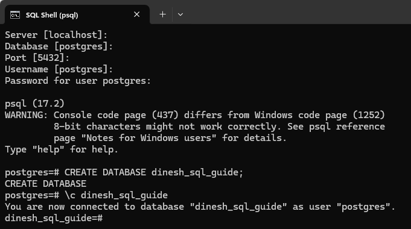
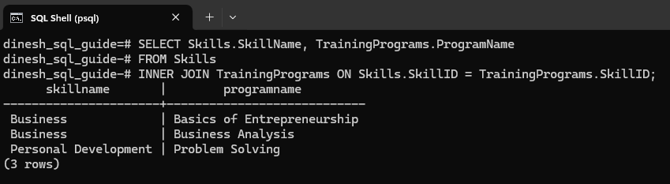
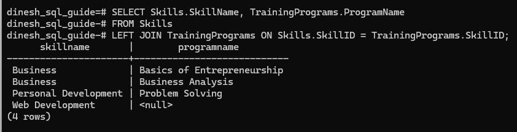
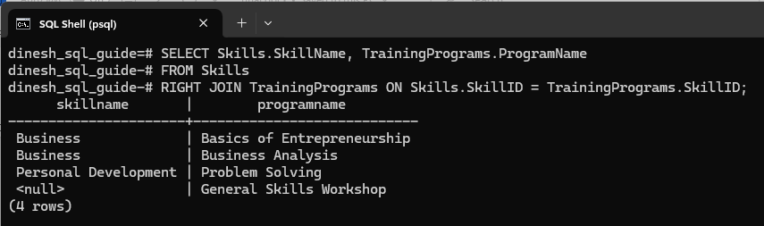
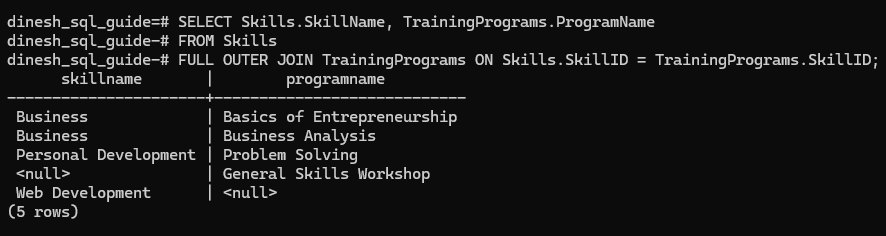

# PostgreSQL Joins Explained with Practical Examples
This document explores the world of PostgreSQL joins, covering inner, left, right, and full outer joins through practical examples. We'll start by setting up sample tables in the Windows environment and inserting data into them, and then we'll walk through each type of join with an example and explanation.

---

## Setting Up Tables with Data
When you start psql and connect to your PostgreSQL server, you're generally connecting to an existing database, usually the *postgres* database with the *postgres* username by default. To work through the examples, we'll create a separate database.

<span class="step-number">1</span> Create the database:

```pgsql
CREATE DATABASE dinesh_sql_guide;
```

<span class="step-number">2</span> Connect to the new database:

```pgsql
\c dinesh_sql_guide
```

Here's my psql window where I am creating and connecting to the new database:



<span class="step-number">3</span> Create the tables to store skills and training programs:

```pgsql
CREATE TABLE Skills (
    SkillID SERIAL PRIMARY KEY,
    SkillName VARCHAR(255) NOT NULL
);

CREATE TABLE TrainingPrograms (
    ProgramID SERIAL PRIMARY KEY,
    SkillID INT,
    ProgramName VARCHAR(255) NOT NULL,
    FOREIGN KEY (SkillID) REFERENCES Skills(SkillID)
);
```

<span class="step-number">4</span> Add the data to the tables:

```pgsql
-- Inserting Skills into the Skills table
INSERT INTO Skills (SkillName) VALUES 
    ('Business'),
    ('Personal Development'),
    ('Web Development');

-- Inserting Training Programs into the TrainingPrograms table
INSERT INTO TrainingPrograms (SkillID, ProgramName) VALUES 
    (1, 'Basics of Entrepreneurship'),
    (1, 'Business Analysis'),
    (2, 'Problem Solving'),
    (NULL, 'General Skills Workshop'); -- This entry has no matching SkillID
```

## Inner Join
An inner join is an SQL operation that combines rows from two or more tables based on a related column. The operation will return only the rows that have matching related column values in both tables.

Here's an inner join:

```pgsql
SELECT Skills.SkillName, TrainingPrograms.ProgramName
FROM Skills
INNER JOIN TrainingPrograms ON Skills.SkillID = TrainingPrograms.SkillID;
```

This query will return skill names and corresponding training programs. Any training programs that don't have a `SkillID` will be filtered out. The programs *Basics of Entrepreneurship*, *Business Analysis*, and *Problem Solving* will be returned because they all have `SkillID` values that match existing skills in the `Skills` table. The *General Skills Workshop* program is filtered out because it has a `NULL SkillID`, which doesn't match any `SkillID` in the Skills table.



## Left Join
A left join returns all rows from the left table and the matched rows from the right table. When there's no match, the result is NULL on the side of the right table.

Here's a left join:

```pgsql
SELECT Skills.SkillName, TrainingPrograms.ProgramName
FROM Skills
LEFT JOIN TrainingPrograms ON Skills.SkillID = TrainingPrograms.SkillID;
```

This query will return skill names and corresponding training programs. All skill names from the left table (`Skills`) are returned, including those that don’t have corresponding entries in the `TrainingPrograms` table.

For example, the *Web Development* skill will be included in the results with a `NULL` value for `ProgramName`, indicating that there are no training programs associated with that skill.



## Right Join
A right join returns all rows from the right table and the matching rows from the left table. If there's no match, you'll see NULLs for columns from the left table.

Here's a right join:

```pgsql
SELECT Skills.SkillName, TrainingPrograms.ProgramName
FROM Skills
RIGHT JOIN TrainingPrograms ON Skills.SkillID = TrainingPrograms.SkillID;
```

This query will return skill names and corresponding training programs. All training programs from the right table (`TrainingPrograms`) are returned, including those that don’t have corresponding entries in the `Skills` table.

For example, the *General Skills Workshop* program will be included in the results with a `NULL` value for `SkillName`, indicating that there are no skills associated with that program.



## Full Outer Join
A full outer join returns all rows from both tables, inserting NULLs in places where there are no matches on either side. This way, no data from either table is excluded from the result.

Here's a full outer join:

```pgsql
SELECT Skills.SkillName, TrainingPrograms.ProgramName
FROM Skills
FULL OUTER JOIN TrainingPrograms ON Skills.SkillID = TrainingPrograms.SkillID;
```

The query will return every skill name and training program from both the `Skills` and `TrainingPrograms` tables, with NULLs where there are no matching entries.



Congratulations! We've covered how SQL joins, such as left join and full outer join, can be used for querying and integrating data. Key points on joins:

- Inner Join: Returns only matching rows from both tables. 
- Left Join: Returns all left, matching right, with nulls on the right for missing matches. 
- Right Join: Returns all right, matching left, with nulls on the left for missing matches.
- Full Outer Join: Returns both, with nulls for missing matches.