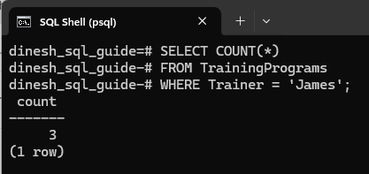
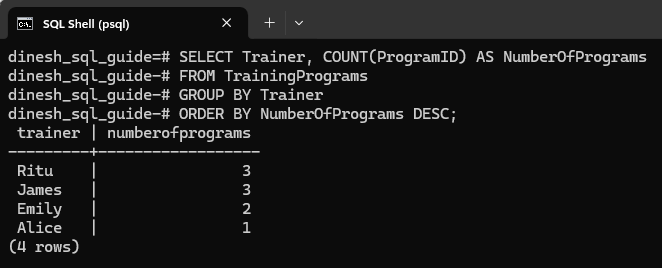
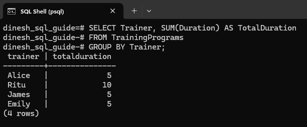
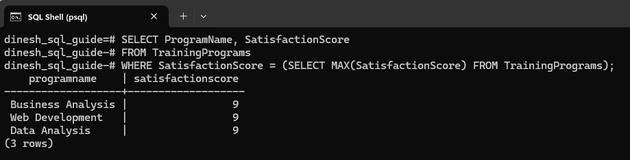
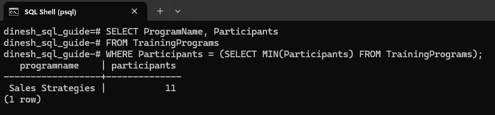
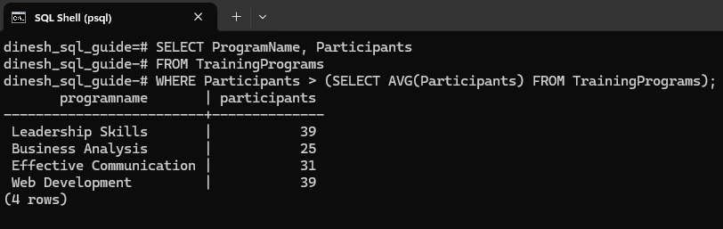

# Using Aggregate Functions in PostgreSQL
This write-up covers five key aggregate functions: COUNT, SUM, MAX, MIN, and AVG. These functions are powerful tools for summarizing and analyzing your data. We'll walk through practical examples to illustrate how each function works.

---

## Setting Up a Table with Data
Before we look at the examples, let's set up our environment. We'll create a sample table in PostgreSQL on a Windows system and add data to it. If you need to create a database to work with these functions, refer to the steps in my [previous tutorial on SQL joins](https://techdineshwrites.hashnode.dev/postgresql-joins-explained-with-practical-examples){target="_blank"}.

Step 1: Open your PostgreSQL command line interface (*psql*) and run the following command to create the `TrainingPrograms` table with columns such as program duration and participant's satisfaction score:

```pgsql
CREATE TABLE TrainingPrograms (
    ProgramID INT PRIMARY KEY,
    ProgramName VARCHAR(50),
    Trainer VARCHAR(50),
    Duration INT,
    Participants INT,
    SatisfactionScore INT
);
```

Step 2: Add some data to the table:

```pgsql
INSERT INTO TrainingPrograms (ProgramID, ProgramName, Trainer, Duration, Participants, SatisfactionScore) VALUES
(1, 'Leadership Skills', 'Alice', 5, 39, 8),
(2, 'Business Analysis', 'Emily', 3, 25, 9),
(3, 'Effective Communication', 'James', 2, 31, 6),
(4, 'Sales Techniques', 'James', 1, 15, 8),
(5, 'Web Development', 'Ritu', 4, 39, 9),
(6, 'Cybersecurity', 'Ritu', 4, 22, 8),
(7, 'Devops', 'Ritu', 2, 15, 8),
(8, 'Data Analysis', 'Emily', 2, 18, 9),
(9, 'Sales Strategies', 'James', 2, 11, 5);
```

## Count
The `COUNT()` function returns the number of rows.

For example, this gives us the number of rows where trainer is *James*:

```pgsql
SELECT COUNT(*) 
FROM TrainingPrograms 
WHERE Trainer = 'James';
```

Here's the result from the SQL query:



If a column is provided, `Count` returns the number of non-NULL values in that column. For example, when you run:

```pgsql
SELECT COUNT(ProgramID) FROM TrainingPrograms;
```

The output will be `9`.

To find the total number of trainers:

```pgsql
SELECT COUNT(DISTINCT Trainer) AS TotalTrainers
FROM TrainingPrograms;
```

The output will be `4`.

Let's consider an interesting use case for the `COUNT()` function. Suppose we want to analyze how many training programs each trainer has conducted. This can help us understand workload distribution of trainers. Use `DESC` to order from the most programs to the least.

```pgsql
SELECT Trainer, COUNT(ProgramID) AS NumberOfPrograms
FROM TrainingPrograms
GROUP BY Trainer
ORDER BY NumberOfPrograms DESC;
```



`COUNT(ProgramID)` counts the total number of programs, and the `GROUP BY` clause ensures that the count is calculated separately for each trainer.

> 💡 **Note:** When you use aggregate functions and other columns together, every non-aggregated column must appear in the <code>GROUP BY</code> clause.

## Sum
The `SUM()` function calculates the total sum of a numeric column.

For example, this gives us the total number of participants:

```pgsql
SELECT SUM(Participants) FROM TrainingPrograms;
```

The result will be `215`.

One interesting use case could be to calculate the total duration of all training programs for each trainer. This can help us understand the overall workload and time investment each trainer has made:

```pgsql
SELECT Trainer, SUM(Duration) AS TotalDuration
FROM TrainingPrograms
GROUP BY Trainer;
```

Result of the query:



Let's take another user case. Calculate the total satisfaction scores given by participants for each trainer:

```pgsql
SELECT Trainer, SUM(SatisfactionScore) AS TotalSatisfactionScore
FROM TrainingPrograms
GROUP BY Trainer
ORDER BY TotalSatisfactionScore DESC;
```

The query returns:


## Maximum
The `MAX()` function returns the maximum value within a column of a table.

For example, this query returns the maximum satisfaction score:

```pgsql
SELECT MAX(SatisfactionScore) FROM TrainingPrograms;
```

The result will be `9`.

To find the programs that achieved the maximum satisfaction score, you can use a subquery to first find the maximum satisfaction score, and then retrieve the programs that have that score:

```pgsql
SELECT ProgramName, SatisfactionScore
FROM TrainingPrograms
WHERE SatisfactionScore = (SELECT MAX(SatisfactionScore) FROM TrainingPrograms);
```

Here's the result from the query:



## Minimum

The `MIN()` function returns the minimum value within a column of a table.

For example, this query returns the lowest number of participants:

```pgsql
SELECT MIN(Participants) FROM TrainingPrograms;
```

The result is `11`.

To find the lowest number of participants and then retrieve the corresponding program:

```pgsql
SELECT ProgramName, Participants
FROM TrainingPrograms
WHERE Participants = (SELECT MIN(Participants) FROM TrainingPrograms);
```

The query returns:



## Average

The `AVG()` function returns the average value of a numeric column.

For example, this query returns the average satisfaction score:

```pgsql
SELECT ROUND(AVG(SatisfactionScore), 2) FROM TrainingPrograms;
```

We've used the `ROUND()` function to limit the decimal points to 2.

The query result is `7.78`.

This query uses a subquery to find programs with a number of participants above the average:

```pgsql
SELECT ProgramName, Participants
FROM TrainingPrograms
WHERE Participants > (SELECT AVG(Participants) FROM TrainingPrograms);
```

The result shows:



To summarize, we've looked into essential SQL aggregate functions: COUNT, SUM, MAX, MIN, and AVG. We applied these functions to practical scenarios, such as calculating total participants and maximum satisfaction score. Through these examples, you've seen how these functions can be used to extract valuable insights from your data.