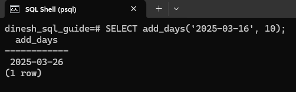
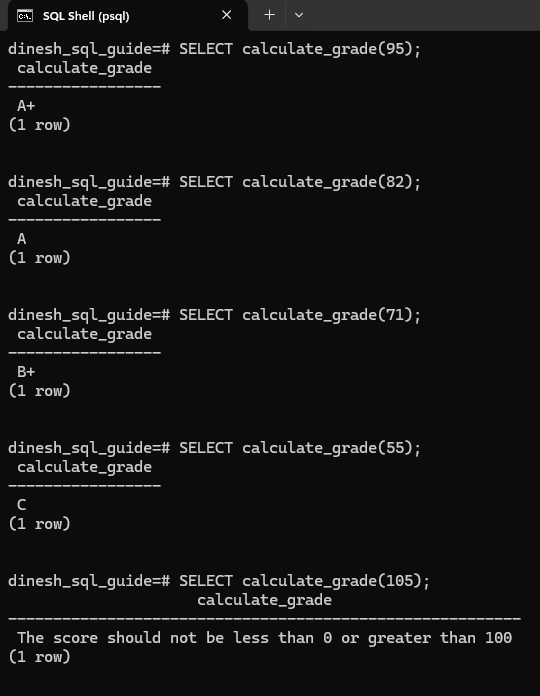
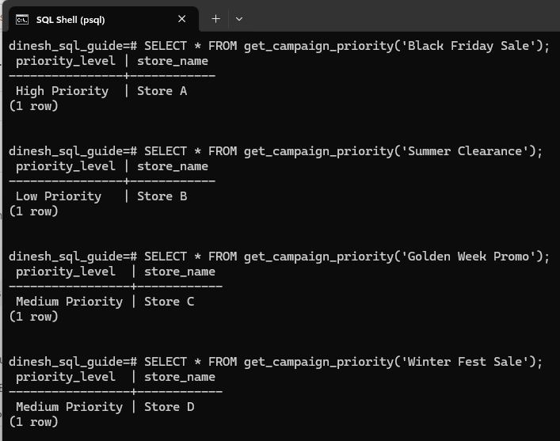

# Defining Functions using PostgreSQL's Procedural Language
A function in PostgreSQL is a named block of code that accepts arguments, performs operations, and returns a result. User-defined functions (UDFs) enable you to perform specific tasks within PostgreSQL. Let's see how to create these functions using PostgreSQL's Procedural Language (*PL/pgSQL*).

---

## User-Defined Function Syntax
Here's the syntax for creating a user-defined function using PL/pgSQL:

```pgsql
CREATE OR REPLACE FUNCTION function_name(parameter_name data_type)
RETURNS return_data_type AS $$
BEGIN
  -- Function logic goes here
  RETURN value;
END;
$$ LANGUAGE plpgsql;
```

* The opening statement defines the function's name, parameters, and the return type.
    
* The `AS $$ ... $$` section contains the function's code.
    
* The `BEGIN ... END;` block is where you implement the function's logic.
    
* The final line specifies the language used (`PL/pgSQL`).

## Example 1: Function to Add Days to a Date
Let's begin with creating a function that takes a date and an integer representing the number of days to be added. The function then returns the new date after adding the specified number of days.

```pgsql
CREATE OR REPLACE FUNCTION add_days(start_date DATE, days_to_add INT)
RETURNS DATE AS $$
BEGIN
  RETURN start_date + days_to_add;
END;
$$ LANGUAGE plpgsql;
```

You can call this function like this: `SELECT add_days('2025-03-16', 10);`. It will return a date 10 days after March 16, 2025:


## Example 2: Function to Calculate Grades
Next up, we'll see how conditional logic and error handling can be implemented in a function. This function takes an integer score as input and returns a corresponding grade.

```pgsql
CREATE FUNCTION calculate_grade(score INTEGER)
RETURNS TEXT AS $$
DECLARE
    grade TEXT;
BEGIN
    IF score < 0 OR score > 100 THEN
        RETURN 'The score should not be less than 0 or greater than 100';
    END IF;

    grade := CASE
        WHEN score >= 90 THEN 'A+'
        WHEN score >= 80 THEN 'A'
        WHEN score >= 70 THEN 'B+'
        WHEN score >= 60 THEN 'B'
        ELSE 'C'
    END;

    RETURN grade;
END;
$$ LANGUAGE plpgsql;
```

The function first checks if the input score is within the valid range (0-100). If it's not, an error message is returned.

`CASE WHEN` is a control flow statement (like IF/ELSIF/ELSE) used for conditional logic.

* **CASE**: Starts the CASE statement.
    
* **WHEN condition THEN result**: Each WHEN clause specifies a condition and the result to return if that condition is true. Each condition is checked one by one. The first condition that evaluates to true determines the result that's returned.
    
* **ELSE default\_result**: The ELSE clause is optional. If none of the WHEN conditions are true, the ELSE result is returned. If you omit the ELSE clause and none of the WHEN conditions are true, the CASE statement will return NULL.
    
* **END**: Concludes the CASE statement. This is *required*.
    

Finally, the function returns the calculated grade.

You can call the function like this:

```pgsql
SELECT calculate_grade(95);   -- Returns 'A+'
SELECT calculate_grade(82);   -- Returns 'A'
SELECT calculate_grade(71);   -- Returns 'B+'
SELECT calculate_grade(55);   -- Returns 'C'
SELECT calculate_grade(105);  -- Returns 'The score should not be less than 0 or greater than 100'
```

Take a look at the screenshot to see it in action:


## Example 3: Function to Determine Campaign Priority for a Store
In our final example, we'll create a function that uses a table. The function determines the priority level (High, Medium, or Low) for implementing a marketing campaign based on estimated total revenue.

Create a table that includes the necessary columns to store the campaign name, store name, and total estimated revenue. These columns will provide the data needed for the function to determine the priority level based on the estimated revenue.

```pgsql
CREATE TABLE campaign_targets (
    campaign_name TEXT NOT NULL,
    store_name TEXT NOT NULL,
    estimated_total_revenue NUMERIC NOT NULL
);
```

Let's add some sample data to the `campaign_targets` table:

```pgsql
INSERT INTO campaign_targets (campaign_name, store_name, estimated_total_revenue)
VALUES 
    ('Black Friday Sale', 'Store A', 20000),
    ('Summer Clearance', 'Store B', 1500),
    ('Golden Week Promo', 'Store C', 9000),
    ('Winter Fest Sale', 'Store D', 10000),
    ('Summer Splash', 'Store E', 5000),
    ('Holiday Bonanza', 'Store F', 16000);
```

Create the function that takes the name of a campaign as input and determines the priority level for implementing that campaign based on the estimated total revenue for a store. It returns a table with two columns: `priority_level` and `store_name`. The priority level is categorized as *High Priority*, *Medium Priority*, or *Low Priority* depending on the revenue thresholds.

```pgsql
CREATE OR REPLACE FUNCTION get_campaign_priority(campaign_name_input TEXT)
RETURNS TABLE (priority_level TEXT, store_name TEXT) AS $$
BEGIN
  RETURN QUERY
  SELECT
    CASE
      WHEN campaign_targets.estimated_total_revenue > 10000 THEN 'High Priority'
      WHEN campaign_targets.estimated_total_revenue > 5000 THEN 'Medium Priority'
      ELSE 'Low Priority'
    END AS priority_level,
    campaign_targets.store_name
  FROM
    campaign_targets
  WHERE
    campaign_targets.campaign_name = campaign_name_input;
END;
$$
LANGUAGE plpgsql;
```

* **RETURN Query**: Runs the `SELECT` query and return its result. The result of this query forms the table structure defined in the `RETURNS TABLE` clause.
    
* **SELECT Query**: The result of the `CASE` expression is aliased as `priority_level`. The `store_name` is selected directly from the `campaign_targets` table.
    

You can call the function like this:

```pgsql
SELECT * FROM get_campaign_priority('Black Friday Sale'); 
SELECT * FROM get_campaign_priority('Summer Clearance'); 
SELECT * FROM get_campaign_priority('Golden Week Promo'); 
SELECT * FROM get_campaign_priority('Winter Fest Sale');
```

The function returns the priority level based on the estimated total revenue:


Congratulations! We have covered the syntax for creating a function, incorporated conditional logic using the `CASE` statement, and worked with table data. We also discussed error handling to ensure the function runs smoothly.