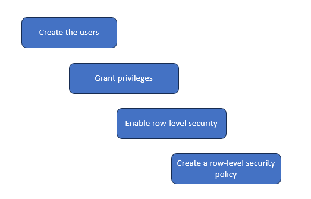
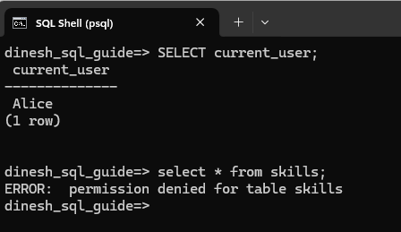
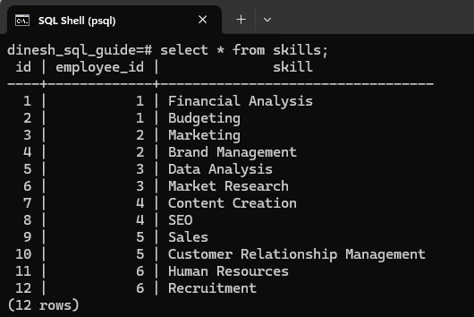
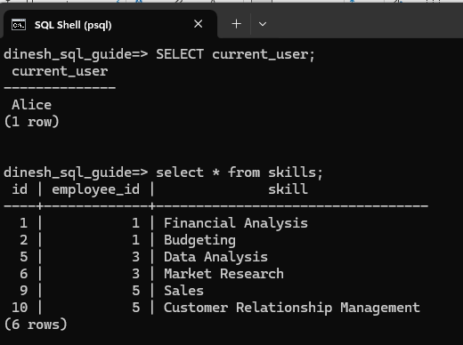
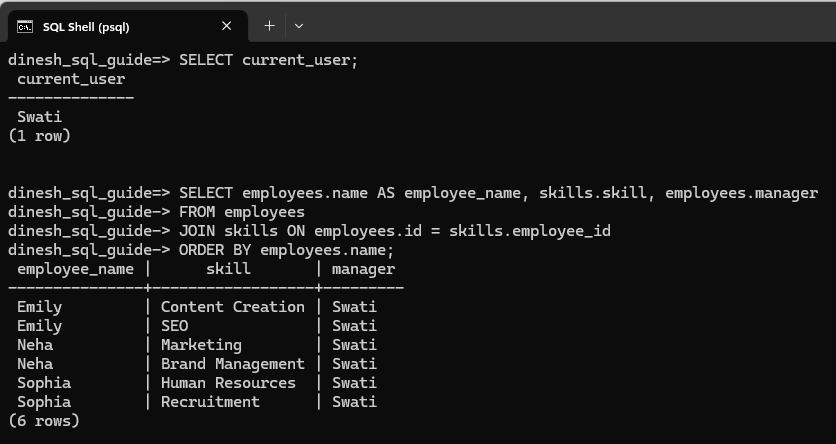

# Implementing Access Control with Row-Level Security in PostgreSQL
Consider this scenario: Managers, Alice and Swati, can only see the skills of their direct reports. For example, Alice can see the skills of employees who report to her and cannot see the skills of employees who report to Swati. To implement this scenario, we'll create the users (Alice and Swati), grant privileges to both, and implement the row-level security so that each manager can only see the skills of their direct reports.



## Create Tables and Add Data to the Tables
Create an `employees` table and a `skills` table to store the relevant data:

```pgsql
CREATE TABLE employees (
    id SERIAL PRIMARY KEY,
    name VARCHAR(50),
    manager VARCHAR(50)
);

CREATE TABLE skills (
    id SERIAL PRIMARY KEY,
    employee_id INT REFERENCES employees(id),
    skill VARCHAR(50)
);
```

Add data into the tables:

```pgsql
INSERT INTO employees (name, manager) VALUES
('Rajesh', 'Alice'),
('Neha', 'Swati'),
('Michael', 'Alice'),
('Emily', 'Swati'),
('Vikram', 'Alice'),
('Sophia', 'Swati');	

INSERT INTO skills (employee_id, skill) VALUES
(1, 'Financial Analysis'),
(1, 'Budgeting'),
(2, 'Marketing'),
(2, 'Brand Management'),
(3, 'Data Analysis'),
(3, 'Market Research'),
(4, 'Content Creation'),
(4, 'SEO'),
(5, 'Sales'),
(5, 'Customer Relationship Management'),
(6, 'Human Resources'),
(6, 'Recruitment');
```

## Create Users
In PostgreSQL, a user is essentially a role with the `LOGIN` attribute. Use the `CREATE ROLE` command to create the users. We want the role names to be case-sensitive and to appear exactly as we define it. For that, use double quotes around the role name:

```pgsql
CREATE ROLE “Alice” WITH LOGIN PASSWORD 'password_for_alice'; 
CREATE ROLE “Swati” WITH LOGIN PASSWORD 'password_for_swati';
```

Ensure that you choose a strong password for each user.

## Grant Privileges
The users, Alice and Swati, won't have access to the `employees` and `skills` tables. For example, if Alice logs in and tries to query the `skills` table, she will get a permission denied error message:



Use the `GRANT` command to assign privileges. There are different kinds of privileges such as `SELECT`, `INSERT`, `UPDATE`, and `DELETE`. To give Alice and Swati view access to the tables, we'll grant them `SELECT` privilege:

```pgsql
GRANT SELECT ON employees TO “Alice”, “Swati”;
GRANT SELECT ON skills TO “Alice”, “Swati”;
```

## Enable Row-Level Security
We don't want the two users to access the skills of all employees. For example, because we gave her SELECT privilege, Alice can now use a select query to view all employees' skills:



We want to restrict data access on the `skills` table based on user roles. So, enable row-level security on the `skills` table:

```pgsql
ALTER TABLE skills ENABLE ROW LEVEL SECURITY;
```

## Create a Row-Level Security Policy
Define a policy that allows Alice and Swati to see only their employees' skills:

```pgsql
CREATE POLICY employee_skills_policy 
ON skills 
FOR SELECT 
USING (employee_id IN (SELECT id FROM employees WHERE manager = current_user));
```

## Log In and Test
Users can log in, and when they access the `skills` table, they will only see the skills of their direct reports. For instance, when Alice logs in and does a select query on `skills`, she can only see the skills of her direct reports:



Swati logs in and runs a select query to see both employee names and their skills. The query displays this information only for those employees who report to her:



Congratulations! We've implemented a basic access control scenario in PostgreSQL. We started by creating user roles using the CREATE ROLE command. We then granted SELECT access to these users so that they have view access to the tables. Finally, we configured a row-level security policy to ensure each user could only access the data they were permitted to see.