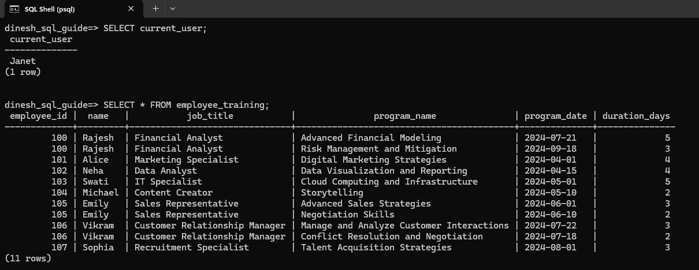
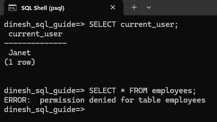
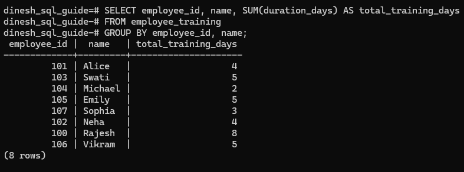
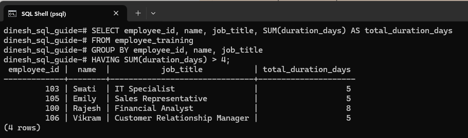

# Understanding the Benefits of PostgreSQL Views
Views are virtual tables that you create by querying data from one or more tables. They don't physically store the data. In this tutorial, we'll create two tables and use a view to retrieve data, highlighting key benefits such as abstracting complex joins and restricting access to specific information.

---

## Create Tables and Add Data
Create `employees` table:

```pgsql
CREATE TABLE employees (
    employee_id INTEGER PRIMARY KEY,
    name VARCHAR(100) NOT NULL,
    job_title VARCHAR(50),
    hire_date DATE NOT NULL,
    date_of_birth DATE NOT NULL,
    performance_rating INTEGER CHECK (performance_rating BETWEEN 1 AND 5)
);
```

Create `training_programs` table:

```pgsql
CREATE TABLE training_programs (
    program_id SERIAL PRIMARY KEY,
    program_name VARCHAR(100) NOT NULL,
    program_date DATE NOT NULL,
    duration_days INTEGER NOT NULL,
    employee_id INTEGER REFERENCES employees(employee_id)
);
```

Add data to the `employees` table:

```pgsql
INSERT INTO employees (employee_id, name, job_title, hire_date, date_of_birth, performance_rating) VALUES
(100, 'Rajesh', 'Financial Analyst', '2023-01-15', '1985-07-23', 3),
(101, 'Alice', 'Marketing Specialist', '2022-11-05', '1990-06-12', 5),
(102, 'Neha', 'Data Analyst', '2021-08-25', '1988-02-17', 4),
(103, 'Swati', 'IT Specialist', '2020-05-30', '1992-03-08', 4),
(104, 'Michael', 'Content Creator', '2019-12-20', '1986-04-19', 3),
(105, 'Emily', 'Sales Representative', '2023-09-10', '1991-01-14', 3),
(106, 'Vikram', 'Customer Relationship Manager', '2020-07-07', '1989-05-05', 2),
(107, 'Sophia', 'Recruitment Specialist', '2021-03-15', '1987-11-22', 4);
```

Add data to the `training_programs` table:

```pgsql
INSERT INTO training_programs (program_id, program_name, program_date, duration_days, employee_id) VALUES
(1, 'Advanced Financial Modeling', '2024-07-21', 5, 100),
(2, 'Risk Management and Mitigation', '2024-09-18', 3, 100),
(3, 'Digital Marketing Strategies', '2024-04-01', 4, 101),
(4, 'Data Visualization and Reporting', '2024-04-15', 4, 102), -- Missing opening quote added
(5, 'Cloud Computing and Infrastructure', '2024-05-01', 5, 103),
(6, 'Storytelling', '2024-05-10', 2, 104),
(7, 'Advanced Sales Strategies', '2024-06-01', 3, 105),
(8, 'Negotiation Skills', '2024-06-10', 2, 105),
(9, 'Manage and Analyze Customer Interactions', '2024-07-22', 3, 106),
(10, 'Conflict Resolution and Negotiation', '2024-07-18', 2, 106),
(11, 'Talent Acquisition Strategies', '2024-08-01', 3, 107);
```

Now that we have set up the table and data, let's understand the benefits of views.

## Simplifying Complex Data and Restricting Access to Specific Data
Suppose Janet is a training manager who wants to see a list of employees and the training programs they have attended. You don't need to give Janet access to the `employees` base table that has confidential information like date of birth and performance rating. You can create a view that hides the complex join as well as prevents access to the confidential fields.

<span class="step-number">1</span> Create the view:

```pgsql
CREATE VIEW employee_training AS
SELECT e.employee_id, e.name, e.job_title, t.program_name, t.program_date, t.duration_days
FROM employees e
JOIN training_programs t ON e.employee_id = t.employee_id;
```

<span class="step-number">2</span> Create user (role) *Janet*.

```pgsql
CREATE ROLE “Janet” WITH LOGIN PASSWORD 'password_for_janet';
```

<span class="step-number">3</span> Grant Janet access to the `employee_training` view:

```pgsql
GRANT SELECT ON employee_training TO “Janet”;
```

<span class="step-number">4</span> Ensure Janet doesn't have access to the base tables by explicitly revoking any access:

```pgsql
REVOKE ALL ON employees, training_programs FROM “Janet”;
```

<span class="step-number">5</span> Janet logs in to PostgreSQL. She can query the `employee_training` view to see the list of employees and the training they have attended:



If she attempts to query the `employees` table, she will see the permission denied error message:



## Easier Maintenance of View Queries
Let's imagine that you want to update the employees table to add a department column. What's great about views is that the query using the view need not be updated.

For instance, you can alter the `employees` table to add a new column:

```pgsql
ALTER TABLE employees ADD COLUMN department VARCHAR(50);
```

Then update the `employees` data:

```pgsql
UPDATE employees
SET department = CASE employee_id
    WHEN 100 THEN 'Finance'
    WHEN 101 THEN 'Marketing'
    WHEN 102 THEN 'Data Analysis'
    WHEN 103 THEN 'IT'
    WHEN 104 THEN 'Content'
    WHEN 105 THEN 'Sales'
    WHEN 106 THEN 'Customer Relations'
    WHEN 107 THEN 'HR'
END;
```

Now, when Janet runs the query, she will still get the same results without needing to change her query:


This shows how views provide easy maintenance and ensures that users like Janet don't need to modify their queries even when the base tables are updated.

## Reusability
Imagine Janet needs to see the total number of training days each employee has attended. She can reuse the view in a new query:

```pgsql
SELECT employee_id, name, SUM(duration_days) AS total_training_days
FROM employee_training
GROUP BY employee_id, name;
```

The results will show the total number of training days for each employee:



Here's another example. Suppose she needs to find employees who have attended training programs with a total duration of more than 4 days:

```pgsql
SELECT employee_id, name, job_title, SUM(duration_days) AS total_duration_days
FROM employee_training
GROUP BY employee_id, name, job_title
HAVING SUM(duration_days) > 4;
```

The results will display the employees who meet the criteria:



Congratulations! We have covered how views can simplify complex data and restrict access to specific data. We have also seen how maintaining and reusing view queries can be done with ease.