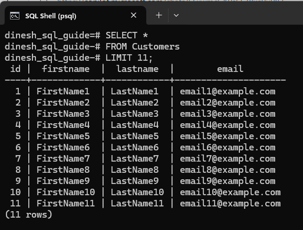
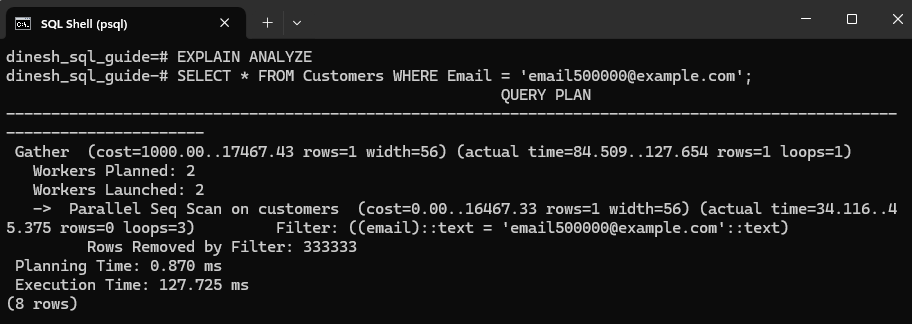
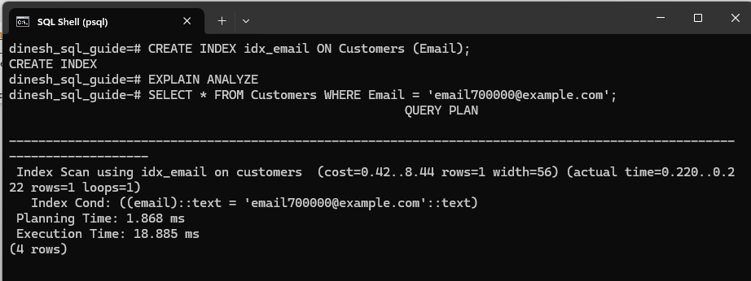

# Speeding Up Queries with PostgreSQL B-tree Indexing
A B-tree index in PostgreSQL can significantly improve query performance by making data retrieval faster. Think of this index like the index of a nonfiction book. If you want to find information about a flower named *Blue orchid*, you'd flip to the index at the end of the book, look for *Blue orchid*, and find the page numbers where it's discussed. Similarly, in a database, a B-tree index helps PostgreSQL quickly locate the rows associated with the data you're searching for, instead of scanning the entire table.

In this walkthrough, we'll focus on the default B-tree index to demonstrate how it improves query performance, step by step.

---

## Create a Table
Create the `Customers` table:

```pgsql
CREATE TABLE Customers (
    ID SERIAL PRIMARY KEY,
    FirstName VARCHAR(50),
    LastName VARCHAR(50),
    Email VARCHAR(100)
);
```

## Insert a Large Data Set
Indexes are especially useful when working with large datasets because they help speed up data retrieval. To demonstrate this, we'll insert a substantial dataset into the `Customers` table.

You can use a single query with the `generate_series()` function to insert multiple rows in PostgreSQL:

```pgsql
INSERT INTO Customers (FirstName, LastName, Email)
SELECT 
    'FirstName' || g AS FirstName, 
    'LastName' || g AS LastName, 
    'email' || g || '@example.com' AS Email
FROM generate_series(1, 1000000) g;
```

This SQL code performs a bulk insert into the `Customers` table. It generates 1,000,000 rows using `generate_series(1, 1000000)`, where each row has a unique `FirstName`, `LastName`, and `Email` constructed by concatenating the strings *FirstName*, *LastName*, and *email* with the generated sequence number. The result is one million new customer records.

For instance, this screenshot shows the first 11 records from the table after data has been inserted:



## Run a Query Without an Index
Run a query without creating an index to observe performance:

```pgsql
EXPLAIN ANALYZE
SELECT * FROM Customers WHERE Email = 'email500000@example.com';
```

When I ran the query, I got this result:



The database performed a **Parallel Sequential Scan**, which examines every row to locate the matching result. While this approach is acceptable for small datasets, it becomes increasingly inefficient and time-consuming as the table size grows. Note the **Execution Time**, which is measured at **127.725 ms**, highlighting the impact of scanning the entire dataset without indexing.

## Create an Index
Create an index on the `Email` column:

```pgsql
CREATE INDEX idx_email ON Customers (Email);
```

## Run a Query Again
Now that we've created the index, run a query again:

```pgsql
EXPLAIN ANALYZE
SELECT * FROM Customers WHERE Email = 'email700000@example.com';
```

This time I got this result from the query:



Note the difference: Execution time has considerably reduced to **18.885 ms** and the query now uses an **Index Scan**, dramatically reducing the number of rows scanned.

Rather than scanning every row in the table to locate `email700000@example.com`, as is the case with a sequential scan in a previous step, PostgreSQL now uses the index on the `Email` column to efficiently pinpoint the exact row. By using the index, it quickly jumps to the relevant entry for `email700000@example.com`, retrieves the row, and returns the result, significantly speeding up the query.

Let's once again look at the comparison:

| **Scenario** | **Scan Type** | **Execution Time** |
| --- | --- | --- |
| Without Index | Sequential Scan | 127.725 ms |
| With Index | Index Scan | 18.885 ms |

Congratulations! We've understood the difference between a sequential scan and an index scan, and we've seen how an index can significantly speed up query performance.