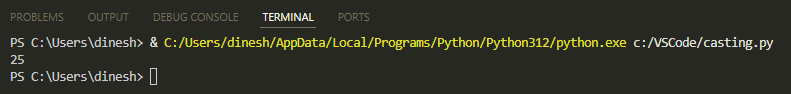
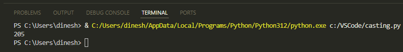
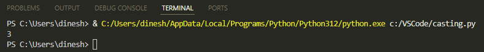
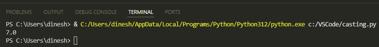
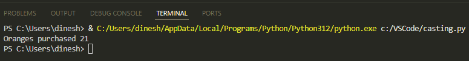

# Casting in Python
We'll be discussing the concept of casting and then moving on to practical examples of casting in Python.

---

## Concept of Casting
With casting, you can convert a variable from one type to another.

If we use the following code, Python automatically decides *x* and *y* to be integer, based on assigned values:

```python
x = 20
y = 5
```

However, if *x* and *y* were strings, then we'll need to convert them to integers to perform arithmetic operations. In the following code, `x = “20”` and `y = “5”` are defined as strings. The code then uses the `int()` function to cast these strings to integers.

```python
x = "20"
y = "5"
x = int(x)
y = int(y)
total = x + y
print(total)
```

The output will be:



If we didn't cast them into integers, then instead of arithmetic operation, the strings will be concatenated. For example, this code isn't casting *x* and *y* into integers:

```python
x = "20"
y = "5"
total = x + y
print(total)
```

The output will be:



## Converting Other Data Types

Now that we've understood the concept of casting, let's see how to convert different data types in Python.

In this code, the float value of 3.9 is converted to integer:

```python
x = int (3.9)
print(x)
```

The output will be:



In this code, the integer value of 7 is converted to float:

```python
x = float (7)
print(x)
```

The output will be:



In this code, the integer value of 21 is converted to string and concatenated with another string:

```python
x = 21
x = str(x)
print ("Oranges purchased " + x)
```

The output will be:



You've learned the concept of casting, with examples like string to integer and integer to float. Thanks for reading this short tutorial!