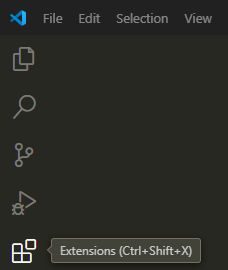

# Using Markdown
Markdown is a language to format and structure documents. Its syntax is minimal and easy to use.

There are various tools that support markdown. For this document, we'll use Visual Studio Code (VS Code) on Windows.

---

## Install the VS Code Extension
I installed the Markdown All in One extension for this tutorial. Here's how I did that:

<span class="step-number">1</span> Open VS Code.

<span class="step-number">2</span> Click the Extensions icon on the side of the VS Code window or press *Ctrl+Shift+X*.



<span class="step-number">3</span> In the Extensions view, search for the extension *Markdown All in One* and install it.

## Create a File
Create a markdown file with the extension of `.md`, for example, `markdown_example.md`.

## Bold and Italics
Surround the text with `*` to make the text in italics.

Surround the text with `**` to make the text bold.

Or in VS Code, you can simply press *Ctrl+I* to italicize selected text and press *Ctrl+B* to bold selected text.


## Preview the Text
To preview the text on a side pane, click the **Open Preview to the Side** icon in the top-right corner.


The preview will then appear on the right side in VS Code:


Alternatively, you can press *Ctrl+Shift+V* to open a separate preview pane.

## Headings
In Markdown, `#` are used to indicate headings and the number of `#` indicates the heading levels:

```markdown
# Heading Level 1

## Heading Level 2

### Heading Level 3

#### Heading Level 4
```

Here's an example with the preview on the right pane:


## Lists
To add bulleted lists, you can use hyphen (`-`). Each time you press *Enter*, a new bullet appears automatically.

To add numbered lists, use `1` followed by a period. Each time you press *Enter*, the next number in the sequence appears automatically.

You can indent items with space or tab to make them subitems.


## Links
The syntax for link is: `[Link Text](URL)`

Here's an example:


This is the preview:


## Images
The syntax for link is: ``

For the following example, I simply copied and pasted the image in the markdown file. The syntax is automatically entered and I edited only the alt text. The image is automatically saved in the same folder as the markdown file.


This is the preview:


## Tables
To create a table, use the pipe characters (`|`) to define columns and hyphens (`-`) to define the header row.

Here's an example with the preview on the right pane:


## Code Block and Inline Code
To format a code block, surround the text with triple backticks.

To format inline code, surround the text with single backticks.

Here's an example to illustrate both a code block and inline code:


This is the preview:


Or you can simply use the *Markdown All in One* commands to format text as code blocks or inline code:


Access these commands from the VS Code Command Palette. Press *Ctrl+Shift+P* to open the Command Palette.

## Print HTML
<span class="step-number">1</span> Open the markdown file:


<span class="step-number">2</span> Open the Command Palette.

<span class="step-number">3</span> Select *Markdown All in One: Print current document to HTML* from the Command Palette.

The HTML file is automatically saved in the same folder as the markdown file:


Congratulations! You've explored the various ways to format and structure a document with Markdown, from adding headings and lists to code blocks. Additionally, you've learned how to print HTML from a markdown document using the Markdown All in One extension.