# Using reStructuredText with Sphinx
reStructuredText is a markup language for formatting and structuring documents, similar to Markdown.

reStructuredText is commonly used with Sphinx to generate documentation. Sphinx is a tool that converts `.rst` (reStructuredText) files into various output formats, such as HTML.

This document walks you through the steps to set up Sphinx on Windows, write reStructuredText in `.rst` files, and then view the output in HTML format.

---

## Install Python
Python is needed to run Sphinx. You can download Python from here: [https://www.python.org/downloads/](https://www.python.org/downloads/){target="_blank"}

## Install Sphinx and Initialize a Project
Step 1: Open Command Prompt.

Step 2: Create a virtual environment:

`python -m venv .venv`

Step 3: Activate the virtual environment:

`.\.venv\Scripts\activate`

Step 4: Install Sphinx in the virtual environment:

`pip install sphinx`

Sphinx will start installing:

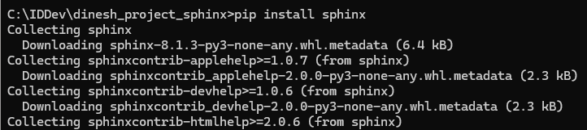

Step 5: Initialize a Sphinx project:

`sphinx-quickstart`

When the quickstart utility runs, it will ask you to specify various configuration options. I opted for separate source and build directories. I also entered the project name, author name, and project release, and left the language blank to select the default as English.

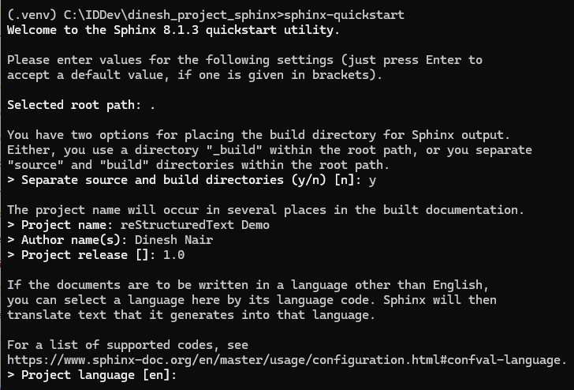

Quickstart will create the necessary directory structure of the project with all the essential files:

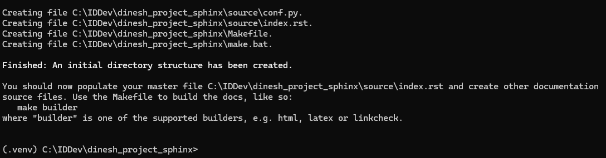

After running the quickstart utility, my project directory looks like this in Windows Explorer:

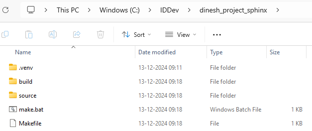

## Create .RST Files
`.rst` files are reStructuredText files. The `index.rst` file was already created when you ran the quickstart utility.

We'll create other `.rst` files in the source directory to learn how reStructuredText formats documents. Each of these `.rst` files correspond to different content types, such as headings and lists.

### Headings
Create a file named `headings.rst` with this content:

```rst
Headings
========
This is the highest level of heading (Heading 1).

Heading 2
---------
This is the second level of heading.

Heading 3
~~~~~~~~~
This is the third level of heading.

Heading 4
^^^^^^^^^
This is the fourth level of heading.
```

The `headings.rst` content shows how to format different heading levels.

### Lists
Create a file named `lists.rst` with this content:

```rst
Lists
=====

Bullet Points
-------------

- Item 1
- Item 2
- Item 3
- Item 4

Numbered List
-------------

1. First item
2. Second item
3. Third item
4. Fourth item
```

The `lists.rst` content shows how to format bulleted and numbered lists.

### Images and Links
Create a file named `imagesandlinks.rst` with this content:

```rst
Images and Links
================

.. image:: images/image-unsplash.jpg
   :alt: Sample Image
   :width: 600px
   :align: center

This is a caption for the sample image.

Photo by `Daniel Peters <https://unsplash.com/@danee?utm_content=creditCopyText&utm_medium=referral&utm_source=unsplash>`_ on `Unsplash <https://unsplash.com/photos/landscape-photography-of-brown-trees-2tvkoVK8prc?utm_content=creditCopyText&utm_medium=referral&utm_source=unsplash>`_
```

I created the `images` directory in the source directory and added an image named `image-unsplash.jpg`.

The image credit link uses backticks and an underscore like this:

```rst
`Link Text <https://example.com>`_
```

### Tables
Create a file named `tables.rst` with this content:

```rst
Tables
======

.. _product_table:

.. list-table:: Product Table
   :header-rows: 1

   * - Product ID
     - Product Name
   * - 101
     - Laptop
   * - 102
     - Smartphone
   * - 103
     - Headphones
   * - 104
     - Monitor
```

This is used before the table header to create a reference label:

```rst
.. _product_table:
```

We'll see how the label is used for cross-reference later on.

This indicates that the first row is a header row of the table:

```rst
:header-rows: 1
```

This indicates a new row:

```rst
* -
```

### Code Examples
Create a file named `codeexamples.rst` with this content:

```rst
Code Examples
=============

Code that uses a simple `for` loop to initialize `i` to 1 and print the values from 1 to 5.

.. code-block:: python

    # Simple for loop
    for i in range(1, 6):
        print(i)
```

As shown in the example, ensure the code is properly indented under the `.. code-block::` directive.

### Cross-references
Create a file named `crossreferences.rst` with this content:

```rst
Cross-references
================

We offer computer-related products of different brands. 

For a list of our products, refer to the :ref:`Product Table <product_table>` page.
```

We've created a cross-reference to the tables file using the format:

```rst
:ref:`Link Text <reference_label>`
```

### Notes
Create a file named `notes.rst` with this content:

```rst
Notes
=====

.. note::

   Text that provides additional information to the reader.

.. warning::

   Text that points the reader to something that's important to consider.

.. seealso::

   For more information about Sphinx, see the `Official Documentation <https://www.sphinx-doc.org>`_.
```

## Update index.rst File
We'll now edit `index.rst` to add a table of contents. This file represents the home page, so we'll also give an overview of the various content types, such as headings and lists.

Here's the updated content for `index.rst`:

```rst
.. toctree::
   :maxdepth: 1
   :hidden:

   headings
   lists
   imagesandlinks
   tables
   codeexamples
   crossreferences
   notes

Welcome!
========

This documentation demonstrates various reStructuredText features.

**Headings**

Refer to the *Headings* topic for examples of how to create different levels of headings.

**Lists**

Refer to the *Lists* topic for examples of bullet points and numbered lists.

**Images and Links**

Refer to the *Images and Links* topic to learn how to add images and links.

**Tables**

Refer to the *Tables* topic to learn how to add tables in your documentation.

**Code Examples**

See the *Code Examples* topic to learn how to format code examples.

**Cross-references**

Refer to the *Cross-references* topic to learn how to cross-reference in your documentation.

**Notes**

See the *Notes* topic for examples of note and warning.
```

Here's a breakdown of what this file will do:

The `.. toctree::` directive creates a table of contents.

The `:maxdepth: 1` option indicates the maximum depth of the table of contents. In this case, it will only include the first level of headings.

The `:hidden: `option hides the table of contents from the main document. But Sphinx still processes it to generate the navigation pane, allowing users to easily navigate through the documentation.

The list beneath (`headings`, `lists`, `imagesandlinks` and so on) represents the names of `.rst` files. These files are linked as entries in the table of contents.

## Build the Documentation
Generate the HTML files by running the build command:

`sphinx-build -M html source/ build/`

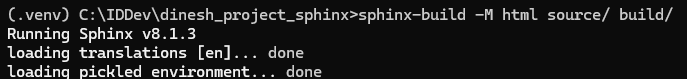

After the build runs, it indicates that the html files are in the `build\html` directory:

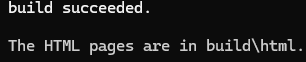

## Review the Documentation
After building your documentation, you can review the generated HTML files to ensure everything is formatted correctly. For each `.rst` file, a corresponding `.html` file is generated. The `.html` files are in the `build\html` directory. Open `index.html` in your web browser to see your documentation.

This is what you'll see when you open the `index.html` file:

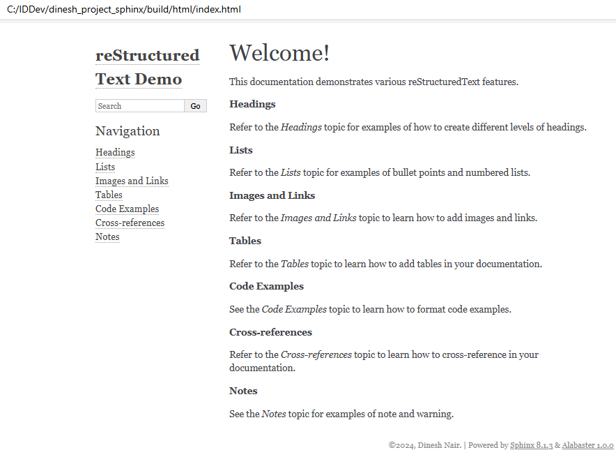

### Headings
Click **Headings** on the navigation pane to view the `headings.html` page:

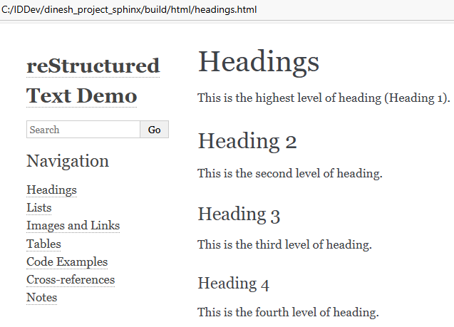

### Lists
Click **Lists** on the navigation pane to view the `lists.html` page:

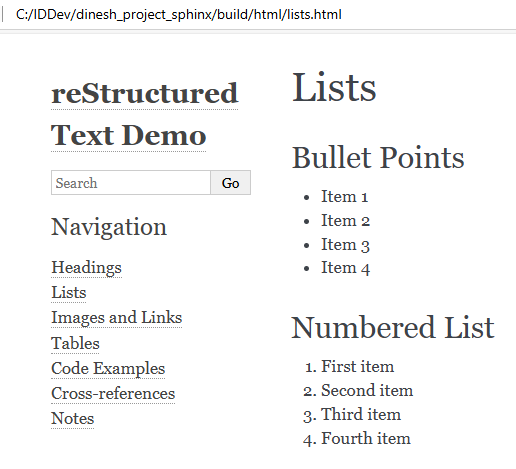

### Images and Links
Click **Images and Links** on the navigation pane to view the `imagesandlinks.html` page:

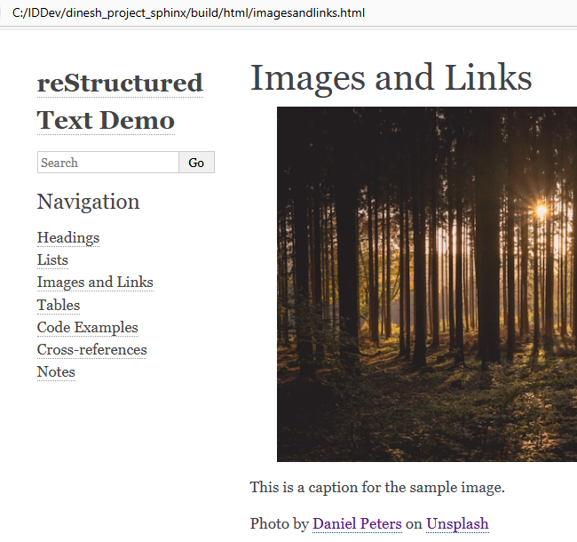

### Tables
Click **Tables** on the navigation pane to view the `tables.html` page:

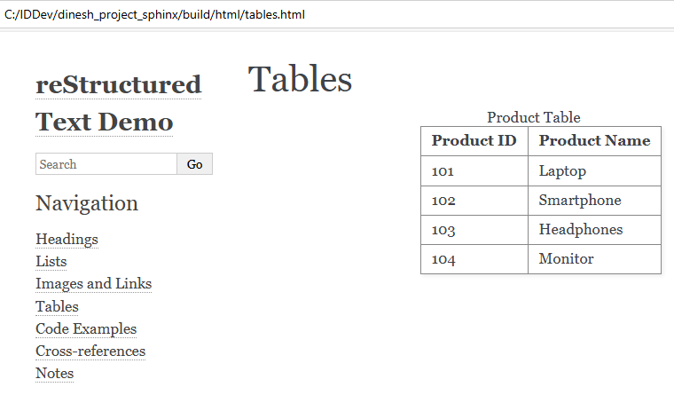

### Code Examples
Click **Code Examples** on the navigation pane to view the `codeexamples.html` page:

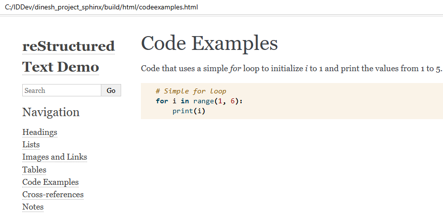

### Cross-references
Click **Cross-references** on the navigation pane to view the `crossreferences.html` page:

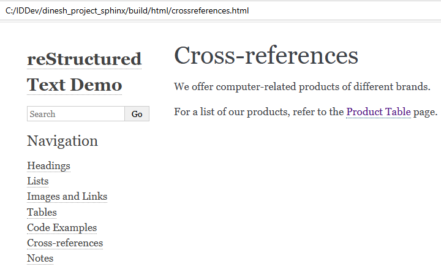

The reader can click the **Product Table** link to navigate to the product table on the `tables.html` page.

### Notes
Click **Notes** on the navigation pane to view the `notes.html` page:

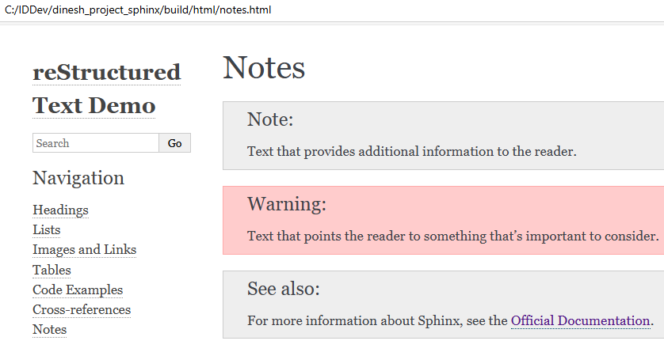

Congratulations! You've learned how to set up Sphinx, explored ways to format and structure documents using reStructuredText, and how to build HTML documentation from the source `.rst` files.