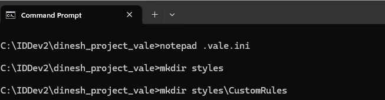
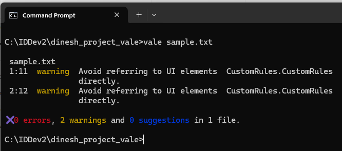

# Vale for Beginners: Creating Your First Style Check
Vale helps you enforce style guide rules in documentation, ensuring consistency and clarity in writing. To install Vale, visit Vale's official website - [vale.sh](https://vale.sh/){target="_blank"} - and follow the setup instructions.

---

## Create the Vale Configuration File
Vale looks for a `.vale.ini` file to know which styles to apply. After installing Vale, you'll need to create this file in your working directory. Add the following basic configuration to the `.vale.ini` file and save it:

```ini
StylesPath = styles

[*]
BasedOnStyles = CustomRules
```

- `StylesPath = styles` defines the directory where Vale looks for style rule definitions.
- `[*]` applies rules to all file types by default. If you want different rules for Markdown or AsciiDoc, you can specify them under `[md]` or `[adoc]`.
- `BasedOnStyles = CustomRules` tells Vale to use the `CustomRules` style guide, and you'll create a *CustomRules* directory inside the *styles* folder to hold your custom checks.

## Create the Styles Directory
Step 1: Create a *styles* directory inside your working directory. 

Step 2: Inside the *styles* directory, create the *CustomRules* directory.



## Create the CustomRules File
Now that you've set up the *CustomRules* directory, it's time to define a custom style rule.

Create a new file named `CustomRules.yml` in the *CustomRules* directory.

To ensure documentation focuses on what the user needs to do, rather than how they interact with the UI, let's define YML rules to flag UI elements. Add the following rules to the `CustomRules.yml` file:

```yml
extends: existence
message: "Avoid referring to UI elements directly."
level: warning
nonword: true
tokens:
  - "checkbox"
  - "check box"
  - "radio button"
  - "button"
```

## Test Vale Against a Sample File
Step 1: Create a sample file (for example, `sample.txt`) in the working directory.

Step 2: Add some sentences with UI elements to the sample file: 

```text
Click the button to submit.
Select the checkbox to enable dark mode.
```

Step 3: Run Vale to check the file:

`vale sample.txt`

When you run the command, Vale will alert you that two sentences contain UI-related terms:



## Fix Sentences Flagged by Vale  

The writer can revise sentences as follows to ensure UI elements are not explicitly mentioned:  

| Original Sentence (Flagged by Vale) | Revised Sentence |
|-------------------------------------|------------------|
| Click the button to submit.        | Submit the form. |
| Select the checkbox to enable dark mode. | Enable dark mode in settings. |

Congratulations! You've successfully set up your first YML rule for Vale. Taking advantage of Vale is a great way to improve documentation quality and ensure consistency.