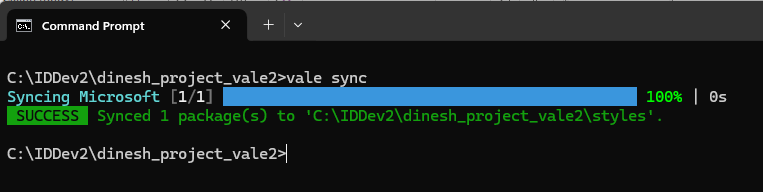
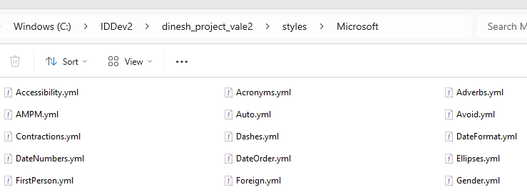
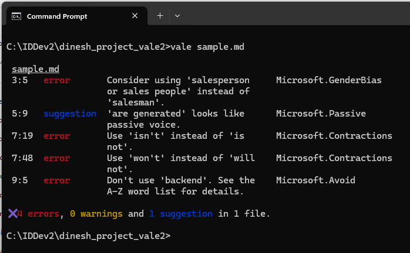
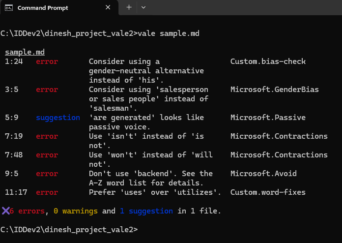

# Configuring Vale: Using a Standard Style Guide and Extending It
This document explains how to configure Vale with the Microsoft Style Guide. Then, we'll enhance the style guide by defining a couple of custom rules.

> 💡 **Note:** The document uses a community-maintained Vale package based on the Microsoft Writing Style Guide: [https://github.com/errata-ai/Microsoft](https://github.com/errata-ai/Microsoft){target="_blank"}. The package is not officially supported or published by Microsoft.

---

## Configure Vale to Use the Microsoft Style Guide
Step 1: In your project directory, create a `.vale.ini` file with the following content:

```ini
StylesPath = styles
MinAlertLevel = suggestion

Packages = Microsoft

[*.md]
BasedOnStyles = Microsoft
```

- `StylesPath = styles` defines the directory where Vale looks for style rule definitions.
- `MinAlertLevel = suggestion` configures Vale to display all alerts, including suggestions, warnings, and errors.
- `Packages = Microsoft` directs Vale to include the Microsoft package.
- `[*.md]` ensures that Vale applies style rules only to Markdown `(.md)` files.
- `BasedOnStyles = Microsoft` instructs Vale to base its checking on the Microsoft style guidelines.

Step 2: Create a *styles* directory in the project directory.

Step 3: Download the Microsoft Style Guide rules. Run the following command in your project directory: `vale sync`



This automatically downloads all the YML files into the *styles/Microsoft* directory. The Microsoft directory will contain the style rules as YML files, and it will look like this:



Step 4: Let's test our setup.

Create a Markdown file (for example, `sample.md`) in the working directory and add the following content:

```md
Each user should enter his credentials to log into the application.

The salesman will assist you with purchasing enterprise solutions.

Reports are generated based on user data.

If the connection is not stable, data transfer will not complete.

The backend manages request routing and authentication.

The application utilizes cloud storage to securely save files.
```

Run Vale on the document: `vale sample.md`

When you run the command, Vale will flag sentences based on the Microsoft style guide and display alerts:



### Sentence Revisions
Based on feedback from Vale using the Microsoft Style Guide, the writer can revise the sentences as shown in this table:  

| Original Sentence | Notes | Revised Sentence |
|-------------------|-------|------------------|
| The salesman will assist you with purchasing enterprise solutions. | "Salesman" is gender-specific. Use an inclusive term. | The salesperson will assist you with purchasing enterprise solutions. |
| Reports are generated based on user data. | Passive voice detected. Active voice is clearer. | The application generates reports based on user data. |
| If the connection is not stable, data transfer will not complete. | Contractions improve readability in conversational writing. | If the connection isn't stable, data transfer won't complete. |
| The backend manages request routing and authentication. | "Backend" is vague; use a more precise term. | The API gateway manages request routing and authentication. |

## Create Our Own Style Rules in Vale
Two sentences in the Markdown file still seem incorrect:

- Each user should enter his credentials to log into the application.
- The application utilizes cloud storage to securely save files.

Vale isn't flagging "his" (a gender-specific term) and "utilize" (prefer "use" for simplicity). This section will cover how to define custom rules to address these issues.

First, we need to understand how to choose between *substitution* and *existence* in Vale rules. Vale offers two key rule types for enforcing writing guidelines:

- **Substitution**: Used when there is a specific replacement for a term.
- **Existence**: Used when a term should be flagged without enforcing a direct replacement.

Since "his" can be revised based on context, the writer has multiple ways to make the sentence more inclusive. Here are a couple of possible rewrites:

- Users should enter their credentials to log into the application.
- Each user should enter their credentials to log into the application. 

We will use *existence* here because we want to flag the word "his" or "her" as discouraged, without suggesting a specific replacement.

The term "utilize" is a strong case for *substitution*, because "use" is always a clearer, simpler alternative.

Step 1: Create a *Custom* directory in the *styles* directory.

Step 2: In the *Custom* directory, create a new file named `bias-check.yml` to define an existence rule for gendered terms. Add the following settings to the file:

```yml
extends: existence
message: "Consider using a gender-neutral alternative instead of '%s'."
level: error
tokens:
  - his
  - her
```

Step 3: In the *Custom* directory, create another new file named `word-fixes.yml` to define a substitution rule enforcing the replacement of "utilize" with "use". Add the following settings to the file:

```yml
extends: substitution
message: "Prefer '%s' over '%s'."
level: error
swap:
  "utilize": use
  "utilizes": uses
  "utilized": used
  "utilizing": using
```

Step 4: Ensure both rules are enabled in `vale.ini` by adding the *Custom* directory to the configuration:

```ini
StylesPath = styles
MinAlertLevel = suggestion

Packages = Microsoft

[*.md]
BasedOnStyles = Microsoft, Custom
```

In summary, this configuration tells Vale to look for styles in the *styles* folder, report all alert levels including suggestions, use the Microsoft style package, and apply the Microsoft and Custom styles to the Markdown files in the project.

Step 5: Run Vale on the document: `vale sample.md` 

It should display alerts from both the Microsoft style guide and the customized styles we set up.



Nicely done! You've successfully configured the Microsoft Style Guide and created your own custom rules. Your documents are now set to stay clear, consistent, and professional, adapted to your needs.