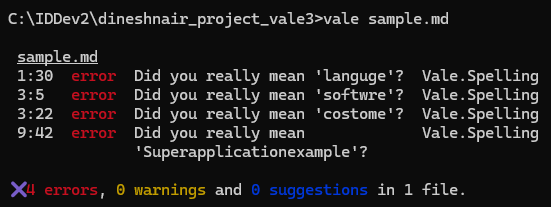
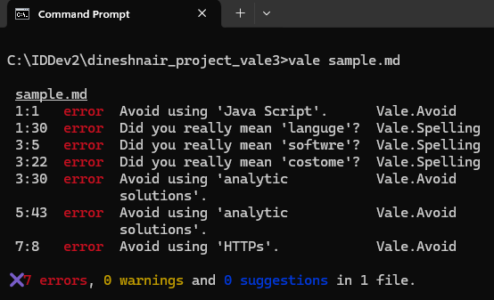

# Enhancing Spell Checks with Accept and Reject Lists
The default Vale setup already includes a basic spell-checking dictionary, so you can use it to catch spelling errors. Additionally, you can customize this spell check with accept and reject lists for more refined control.

---

## Configure Vale for the Basic Spell Check
To use Vale's built-in spelling rules, create a `.vale.ini` file in your project folder with the following content

```ini
MinAlertLevel = suggestion

[*.md]
BasedOnStyles = Vale
```

This enables spell checking for all `.md` files using Vale’s built-in dictionary.

## Create the Markdown Document and Spell Check
<span class="step-number">1</span> We'll create a document with intentional spelling mistakes:  

```md
Java Script is a programming languge.

Our softwre provides costome analytic solutions.

With our platform, you can build your own analytic solutions specific to your business needs.

We use HTTPs protocol for secure communication.

We used React to develop the frontend of Superapplicationexample.
```

<span class="step-number">2</span> Run the sample.md file using Vale: 
`vale sample.md`

The detected spelling mistakes are displayed:



However, notice that "Java Script," "analytic solutions," and "HTTPs" aren't flagged, even though they should be corrected to "JavaScript," "analytics solutions," and "HTTPS." To ensure these terms are properly flagged, we'll create a reject list.

Additionally, "Superapplicationexample" is a product name and shouldn't be considered as an error. We'll create an accept list to allow this term.

## Create the Accept and Reject Lists
Inside your project directory, create the directory structure: `styles\config\vocabularies\myterms`

Add "Java Script," "analytic solutions," and "HTTPs" to the reject list so they are marked as incorrect. Create a `reject.txt` file in the `myterms `directory and add these terms:

```text
Java Script
analytic solutions
HTTPs
```

Add "Superapplicationexample" to the accept list to ensure it's recognized as valid. Create an `accept.txt` file in the `myterms` directory and add this term:

```text
Superapplicationexample
```

This approach refines Vale's spell-checking by explicitly defining acceptable and unacceptable terms.

## Update the .ini File
Update the `.vale.ini` file to include the `styles` folder and the custom vocabulary folder:

```ini
StylesPath = styles
Vocab = myterms
MinAlertLevel = suggestion

[*.md]
BasedOnStyles = Vale
```

`Vocab = myterms` matches the folder name you created for your vocabulary. You can name your custom vocabulary folder anything you like; in this case it's `myterms`.

## Run Vale
Again, run Vale against your sample document: 
`vale sample.md`

You should see:

- Accepted term (*Superapplicationexample*) will NOT be flagged.
- Rejected terms (*Java Script*, *analytic solutions*, *HTTPs*) will be flagged as errors.



## Fix Sentences Flagged by Vale  

The writer can revise sentences as follows:  

| Original Sentence (Flagged by Vale) | Revised Sentence |
|-------------------------------------|------------------|
| Java Script is a programming languge. | JavaScript is a programming language. |
| Our softwre provides costome analytic solutions. | Our software provides custom analytics solutions. |
| With our platform, you can build your own analytic solutions specific to your business needs. | With our platform, you can build your own analytics solutions specific to your business needs. |
| We use HTTPs protocol for secure communication. | We use HTTPS protocol for secure communication. |
| We used React to develop the frontend of Superapplicationexample. |  *No changes needed* |

Well done! You've learned how to use Vale's default spell checker and customize accepted and rejected words, allowing you to fine-tune writing standards.