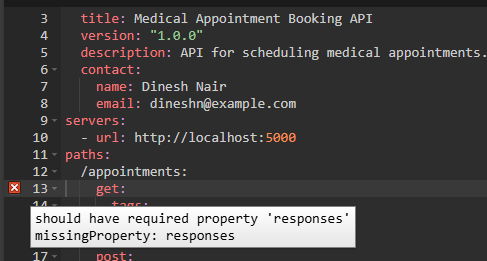
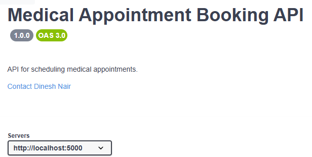
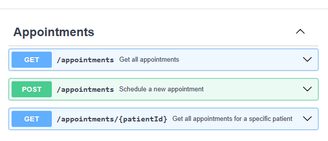
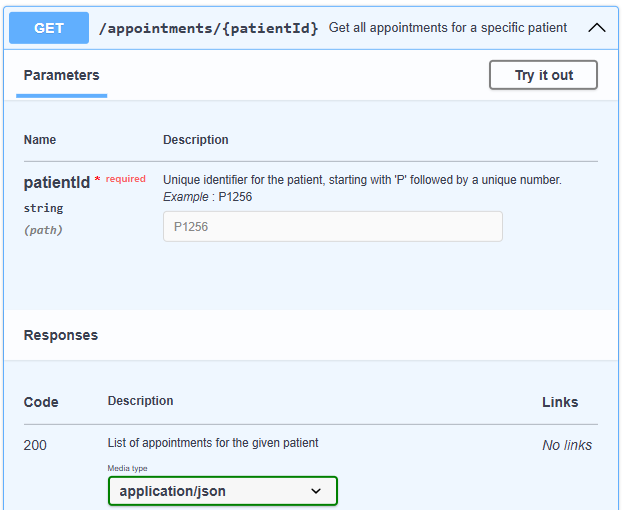
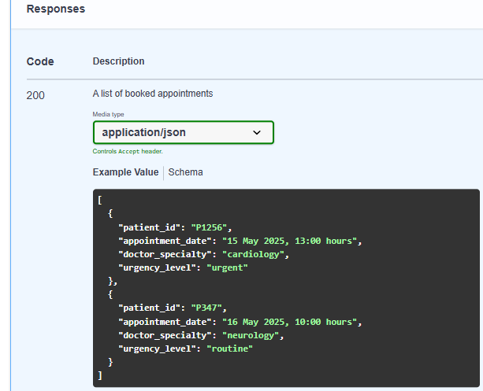
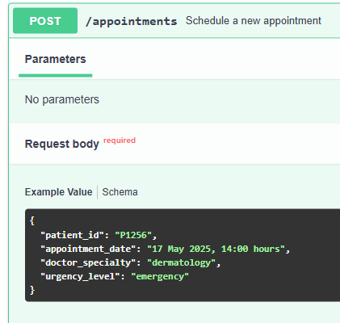
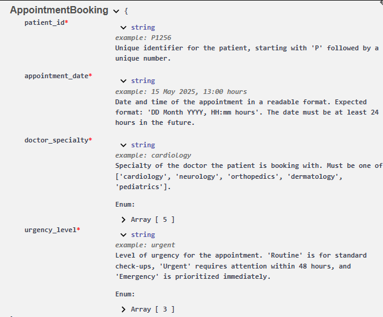

# Using Swagger Editor to Design and Document REST APIs
Swagger Editor is a tool that helps developers design and document REST APIs using the OpenAPI Specification. The OpenAPI Specification acts as a blueprint for how an API should work, including its endpoints, request and response formats, and other details.

This document covers how to use Swagger Editor to define a basic medical appointments API in YAML format and preview the API documentation. By defining the API specification first in Swagger, we are following a design-first approach, ensuring we design the API in YAML before writing any code. Note that API specifications can also be written in JSON, but here, we'll use YAML.

As you define your API, Swagger Editor provides real-time validation and a live preview of your documentation, making it easy to visualize your API structure.

---

## Define the REST API
Open Swagger Editor at [https://editor.swagger.io](https://editor.swagger.io){target="_blank"} and add the API definition in YAML format. We'll go through it step by step, making each section easy to follow:

### OpenAPI Version and General Info
```yml
openapi: 3.0.0
info:
  title: Medical Appointment Booking API
  version: "1.0.0"
  description: API for scheduling medical appointments.
  contact:
    name: Dinesh Nair
    email: dineshn@example.com
```
This section defines the basic metadata about the API, such as its title, version, and purpose. The contact field provides the API owner's details.

### Servers Configuration

```yml
servers:
  - url: http://localhost:5000
```

The servers section lists where the API can be accessed. Here, it's set up for local development.

### Paths for Managing Appointments
```yml
paths:
  /appointments:
    get:
      tags:
        - Appointments
      summary: Get all appointments
      responses:
        '200':
          description: A list of booked appointments
          content:
            application/json:
              schema:
                type: array
                items:
                  $ref: '#/components/schemas/AppointmentBooking'
              example:
                - patient_id: "P1256"
                  appointment_date: "15 May 2025, 13:00 hours"
                  doctor_specialty: "cardiology"
                  urgency_level: "urgent"
                - patient_id: "P347"
                  appointment_date: "16 May 2025, 10:00 hours"
                  doctor_specialty: "neurology"
                  urgency_level: "routine"
    post:
      tags:
        - Appointments
      summary: Schedule a new appointment
      requestBody:
        required: true
        content:
          application/json:
            schema:
              $ref: '#/components/schemas/AppointmentBooking'
            example:
              patient_id: "P1256"
              appointment_date: "17 May 2025, 14:00 hours"
              doctor_specialty: "dermatology"
              urgency_level: "emergency"
      responses:
        '201':
          description: Appointment successfully scheduled
          content:
            application/json:
              example:
                message: "Appointment successfully booked"
  /appointments/{patientId}:
    get:
      tags:
        - Appointments
      summary: Get all appointments for a specific patient
      parameters:
        - in: path
          name: patientId
          schema:
            type: string
          required: true
          description: "Unique identifier for the patient, starting with 'P' followed by a unique number."
          example: "P1256"
      responses:
        '200':
          description: List of appointments for the given patient
          content:
            application/json:
              schema:
                type: array
                items:
                  $ref: '#/components/schemas/AppointmentBooking'
              example:
                - patient_id: "P1256"
                  appointment_date: "18 May 2025, 11:00 hours"
                  doctor_specialty: "orthopedics"
                  urgency_level: "urgent"
        '404':
          description: Patient not found or no appointments available
          content:
            application/json:
              example:
                message: "No appointments found for patient ID P1256"
```

- Clients interact with the API by making requests to specific paths, using HTTP methods such as `GET` to retrieve data or `POST` to create data.
    - `GET /appointments` returns a list of booked appointments, each with details like patient ID, date, doctor specialty, and urgency level.
    - `POST /appointments` lets clients schedule an appointment by submitting details like patient ID, date, doctor specialty, and urgency level. On success, it returns a confirmation message.
    - `GET /appointments/{patientId}` retrieves appointment details for a specific patient ID. If appointments exist, it returns the details; otherwise, a 404 error indicates no appointments were found.

- In OpenAPI, `$ref` is used to reference reusable components, helping avoid duplication and keeping the API definition organized. In our API, `$ref: '#/components/schemas/AppointmentBooking'` means that instead of defining the full schema inline, OpenAPI points to the reusable AppointmentBooking schema under `components/schemas`.

- Earlier, we defined `http://localhost:5000` as the server URL. Clients can access API endpoints by appending the relevant path. For example, `/appointments` would form `http://localhost:5000/appointments`, where a `GET` request retrieves all appointments, and a `POST` request creates a new appointment.

- We added tags to each path. Assigning the same tag (*Appointments*) groups these paths in the Swagger-generated documentation, improving navigation. Without tags, the documentation groups them under a *default* section.

### Data Schema for Appointments
```yml
components:
  schemas:
    AppointmentBooking:
      type: object
      properties:
        patient_id:
          type: string
          description: "Unique identifier for the patient, starting with 'P' followed by a unique number."
          example: "P1256"
        appointment_date:
          type: string
          description: "Date and time of the appointment. Expected format: 'DD Month YYYY, HH:mm hours'. The date must be at least 24 hours in the future."
          example: "15 May 2025, 13:00 hours"
        doctor_specialty:
          type: string
          enum: ["cardiology", "neurology", "orthopedics", "dermatology", "pediatrics"]
          description: "Specialty of the doctor the patient is booking with. Must be one of ['cardiology', 'neurology', 'orthopedics', 'dermatology', 'pediatrics']."
          example: "cardiology"
        urgency_level:
          type: string
          enum: ["routine", "urgent", "emergency"]
          description: "Level of urgency for the appointment. 'Routine' is for standard check-ups, 'Urgent' requires attention within 48 hours, and 'Emergency' is prioritized immediately."
          example: "urgent"
      required:
        - patient_id
        - appointment_date
        - doctor_specialty
        - urgency_level
```
- In OpenAPI, schemas define the structure of data in API requests and responses. The `AppointmentBooking` schema represents an appointment request, specifying required fields (patient_id, appointment_date, doctor_specialty, and urgency_level).

- In the YAML, properties define the individual fields within an object. Each property has attributes such as type (for example, string, integer), description, and example (providing a sample value). These details ensure clear documentation in Swagger-generated references.

- The `enum` keyword in OpenAPI allows you to specify a fixed set of valid values that a field can accept. For example, in the urgency_level field, only "routine", "urgent", or "emergency" will be valid values in requests.

- By using `$ref`, we can reuse this schema across POST request bodies and GET responses, promoting consistency and reducing redundancy.

### Validation of API Design
Swagger Editor will highlight any errors, ensuring the API design is complete and correctly structured. This makes it easy to spot and correct issues. For example, if we remove the responses section from the GET operation on the `/appointments` path, Swagger Editor will show an error message because every operation must define at least one response.



## Preview the Documentation
The right pane of Swagger Editor provides a preview of how the API documentation will look, automatically generated from the OpenAPI specification. The following sections provide a detailed breakdown of the documentation.

### API Metadata and Server URL
The documentation displays key metadata about the API, including its title, version, and description, which help users understand its purpose. The contact field provides details about the API owner, allowing developers to reach out for support or inquiries. Additionally, the server URL defines the base URL where API requests are sent. In this case, the API will be hosted locally, which is useful for testing and development before deploying to a live environment.



### Grouped Operations, Paths, and HTTP Methods 
With the addition of tags, all appointment-related API operations are neatly grouped under the *Appointments* section.

Each path (like `/appointments`, `/appointments/{patientId}`) is shown along with its operations (for example, GET and POST).



### Operation Details 
Each operation (for example, `GET /appointments/{patientId}`) displays its summary. Clicking on it expands further details, including:

- Parameters: Required or optional inputs, such as `patientId`.

- *Try it out* Button: Allows you to send requests directly from Swagger-generated documentation, but it will only work if the API is implemented and hosted at the defined server URL. For example, you can use Flask RestX or FastAPI to implement the API.

- Responses: Displays possible status codes (for example, 200 OK, 404 Not Found), including example responses.



### Example Request and Response
Expanding *Get all appointments* shows an example of a successful 200 response with sample data.



Expanding *Schedule a new appointment* displays a request body example, illustrating how to send data when booking an appointment.



### Schema
The Swagger-generated documentation displays field descriptions when viewing a schema definition. For example, in the `AppointmentBooking` schema, the `patient_id` field is described as *Unique identifier for the patient, starting with "P" followed by a unique number*. This information helps API consumers understand the expected format and constraints of the data they interact with.



That brings us to the end! We have defined an example API in Swagger Editor and examined how Swagger documentation presents the API structure in a clear and structured way, enabling developers to easily understand and use it.


