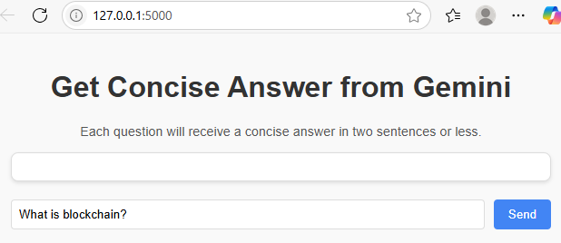
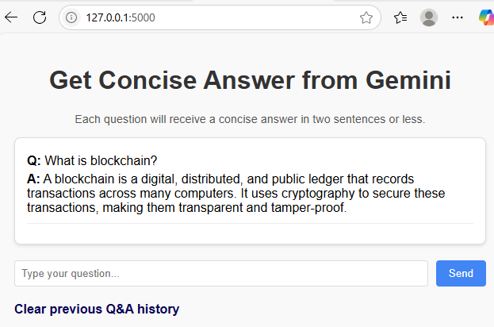

# Creating a Flask Application That Uses Gemini AI
This document demonstrates how to build a Flask web application that connects with Google's Gemini AI. It shows how to use prompt engineering to deliver concise, two-sentence answers to users, and outlines the workflow for integrating with Gemini AI.

---

## Obtain Your Google Gemini API Key
Before you start coding, you'll need an API key to access Google's Gemini AI.

<span class="step-number">1</span> Go to [Google AI Studio](https://aistudio.google.com/){target="_blank"}. If this URL has changed, you can search for *Google Gemini API Key* in Google's AI official documentation.

<span class="step-number">2</span> Sign in with your Google account.

<span class="step-number">3</span> Follow the on-screen instructions to create a new API key. Make sure to keep this key secure, as it authenticates your requests to the Gemini API.

## Set Up the Flask Environment in Windows
<span class="step-number">1</span> Open the terminal in Visual Studio Code and type: `python -m venv venv`

This creates a virtual environment. Using virtual environments ensures that the dependencies for one project don't interfere with the dependencies of other projects.

<span class="step-number">2</span> Activate the virtual environment: `venv\Scripts\activate`

<span class="step-number">3</span> Install the necessary packages: `pip install Flask google-genai`


## Set Up Your API Key
Your Flask application will access the API key. Instead of hardcoding the key in the source code, a more secure approach is to store it as an environment variable.

On Windows, one method to set the GOOGLE_API_KEY environment variable is using your PowerShell terminal like this: `$env:GOOGLE_API_KEY = "your_api_key_here"`. This method only applies to the current PowerShell session.

## Create the Flask Application
Write your Flask application code to interact with Gemini. Using prompt engineering, the application appends *Please answer in two sentences or less.* to each user query before sending it to Gemini, ensuring concise responses.

### Loading the API Key and Initializing the Gemini Client
With the API key set as an environment variable, your code retrieves it using `os.getenv("GOOGLE_API_KEY")`. The client is then initialized with this key, which prepares the application to communicate securely with the Gemini API. This step ensures your application is properly authenticated before making any API requests. 

```python
GOOGLE_API_KEY = os.getenv("GOOGLE_API_KEY")
if not GOOGLE_API_KEY:
    raise ValueError("GOOGLE_API_KEY environment variable not set!")
client = genai.Client(api_key=GOOGLE_API_KEY)
```

The client is an object that enables your application to send requests to and receive responses from the Gemini API.

### Storing Chat History
The code uses a list called `chat_history` to store each question and its corresponding answer. This allows us to display the entire conversation to the user.

```python
chat_history = []
```

### Handling User Input and Generating Responses
The application takes the user's input, formats it into a prompt, and sends it to the Gemini API. The response is stored in `chat_history` along with the original question.

```python
if request.method == 'POST':
    user_input = request.form['message']
    prompt = f"{user_input}. Please answer in two sentences or less."
    # ... (code to call Gemini API and process response)
    chat_history.append({
        'question': user_input,
        'answer': ai_answer
    })
```

### Passing Chat History to the HTML Template
Flask passes the chat history to the HTML template using the `render_template` function. Each time a user submits a question, the updated history list is sent to the template.

```python
return render_template('index.html', history=chat_history)
```

### Clearing the Chat History
This route resets the chat history, allowing users to start a new conversation:

```python
@app.route('/clear')
def clear_chat():
    global chat_history
    chat_history = []
    return redirect(url_for('chat'))
```

### Running the App
Finally, we start the Flask application in debug mode, which provides helpful error messages and automatic reloading during development.

```python
if __name__ == '__main__':
    app.run(debug=True)
```

---

> **⬇️ Download the complete Flask application code:**  
> [FlaskApp.py](FlaskApp.py)

---

## Create the HTML Template
Create a `templates` folder in your Flask project directory and place the `index.html` file inside it. This file is used by Flask to render the UI.

The HTML has three main parts.

Part 1 - **The Input Field and Send Button**: Lets the user type and submit a question.

```xml
<form method="POST">
    <input type="text" name="message" placeholder="Type your question..." required>
    <button type="submit">Send</button>
</form>
```

Part 2 - **The Chat History Box**: Displays all previous questions and answers.

```xml
<div id="chat-history">
    
        <p><strong>Q:</strong> {{ item.question }}</p>
        <p><strong>A:</strong> {{ item.answer }}</p>
        <hr>
    
</div>
```

The HTML template uses Jinja2 to loop through the `history` list variable (passed from Flask) and display each question and answer. As a result, the Chat History Box is dynamically updated with all previous questions and answers, including the latest Gemini response.

Part 3: **The "Clear History" Link**: Lets the user clear the chat history.

```xml

    <a href="/clear" class="clear-link">Clear previous Q&A history</a>

```

---

> **⬇️ Download index.html as a zip file:**  
> [htmlcode.zip](htmlcode.zip)

---

## Run the Application
Start the Flask application: `python FlaskApp.py`

Your application should now be running on `http://127.0.0.1:5000/`.

In the terminal, press Ctrl and click the link to open the web page:


## Send Questions and View Responses 
Enter your question in the input box and click **Send**:



You'll see the response:



Continue asking questions, and all previous questions and responses will remain visible, building a conversation history.


Click **Clear previous Q&A history** to remove all previous questions and answers, resetting the conversation.

---

Congratulations! We've learned how to integrate Google's Gemini AI into a Flask web application, enabling concise, two-sentence responses for users. Through this tutorial, we've got a start on understanding API integration, AI content handling, and user-friendly response generation.