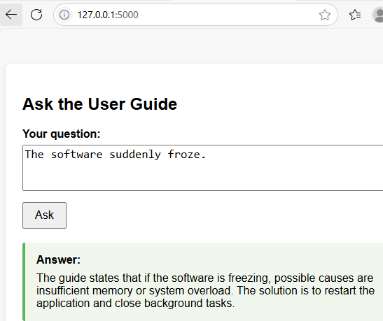

# Building a User Guide Chatbot With Flask and Gemini AI
This tutorial will show you how to build a Flask web application that can answer user questions by referencing a sample user guide written in Markdown. The application will use Google's Gemini language model to search the guide and provide accurate answers.

> **⬇️ Download the sample user guide as a zip file:**  
> [sample_user_guide.zip](sample_user_guide.zip)

---

## Set Up the Flask Environment and API Key on Windows
See the [previous tutorial](../doc26/Flask_Connect_GeminiAI.md){target="_blank"} for instructions on obtaining your Google Gemini API key, setting up the Flask environment, and configuring the API key.

## Create the Flask Application
Now, let's start building the Flask application. We'll use prompt engineering techniques to ensure Gemini answers questions accurately using only information from your Markdown user guide. 

### Loading the Gemini API Key
Load your Gemini API key from an environment variable and create a Gemini client for making API calls:

```python
api_key = os.getenv("GOOGLE_API_KEY")
client = genai.Client(api_key=api_key)
```

This allows the Flask application to securely access Gemini's language model whenever a user submits a question.

### Loading the User Guide
Read your Markdown user guide from a file and load it into memory:

```python
with open("sample_user_guide.md", "r", encoding="utf-8") as f:
    user_guide = f.read()
```

This ensures the Flask application always has the latest version of your documentation to reference for answers.

### Caching Answers
Use a simple dictionary to cache answers to previously asked questions:

```python
cache = {}
```

This helps the Flask application respond faster and reduces the number of API calls to Gemini for repeated questions.

### The ask_gemini Function
Define a function to handle communication with Gemini. It checks the cache, builds a prompt, sends the request, and stores the result.

```python
def ask_gemini(question):
    # ...builds a prompt and sends it to Gemini...
    # ...returns the answer (from cache if available)...
```
This function enables the Flask application to generate accurate, context-aware answers based on your user guide.

We use `max_output_tokens=256` to ensure that long sections from the user guide (such as detailed navigation instructions) are fully included in the answer. Additionally, we set `temperature=0.2` to make the chatbot’s responses more focused and less creative, so answers stay grounded in the guide rather than the model’s imagination. While the prompt already instructs Gemini to answer only using the guide, this low temperature setting is an extra safeguard for accuracy.

### The Main Route
Define the main web page where users can submit questions and see answers:

```python
@app.route("/", methods=["GET", "POST"])
def index():
    # ...handles form submission and rendering...
```

This is where the Flask application receives user questions and calls the `ask_gemini` function to generate answers.

### Running the Application
This launches the Flask application so you can test it in your browser:

```python
if __name__ == "__main__":
    app.run(debug=True)
```

---

> **⬇️ Download the complete Flask application code:**  
> [flask_gemini_guide.py](flask_gemini_guide.py)

---

## Create the HTML Template
Create a `templates` folder in your Flask project directory and place the HTML file inside it. This file is used by Flask to render the UI.

### User Question Form
This section provides a textarea for the user to type their question and a button to submit it:

```xml
<form method="post">
    <label for="question">Your question:</label><br>
    <textarea id="question" name="question" required>{{ question|e }}</textarea><br>
    <button type="submit">Ask</button>
</form>
```

The value of the textarea is set to `{{ question|e }}` so that if the page reloads (after submission), the user's question remains visible and is safely escaped. The `|e` is a filter in Jinja2 called the *escape* filter. It converts special HTML characters in the variable's value into their safe HTML equivalents.

### Displaying the Answer
This block checks if an answer exists and, if so, displays it in a styled box:

```xml

    <div class="answer">
        <div class="answer-title">Answer:</div>
        <pre>{{ answer|e }}</pre>
    </div>

```

### Jinja2 Templating

The template uses Jinja2 syntax:

- `{{ ... }}` is used to insert variables (like question and answer) into the HTML dynamically when Flask renders the page.
- `` is used for logic, such as `` to conditionally display the answer block.

---

> **⬇️ Download askguide.html as a zip file:**  
> [htmlcode.zip](htmlcode.zip)

---

## Run the Application
Start the Flask application: `python flask_gemini_guide.py`

Your application should now be running on `http://127.0.0.1:5000/`.

In the terminal, press Ctrl and click the link to open the web page:


## Ask Questions and View Responses
Enter a question and click **Ask**. For example:

- **Ask about the system requirements:**
The chatbot will provide the answer from the user guide.


- **Ask about "the software suddenly froze":**
The chatbot will reply with information from the guide's Troubleshooting section.



- **Ask "How do I export data?":**
The chatbot will answer using the Basic Operations section of the guide.


- **Ask about view modes:**
The chatbot will again reply from the Basic Operations section.


- **Ask a question not covered in the guide:**
The chatbot will let you know the information isn't available in the guide and will suggest other resources for help.


---

Well done! You've learned how to build a basic Flask chatbot that answers questions from a user guide. The chatbot uses Gemini AI to provide instant, relevant answers from your documentation. This project demonstrates how AI can enhance user support.