# Lists, Dictionaries, Tuples, and Sets in Python
In this document, we'll explore fundamental data structures in Python: lists, dictionaries, tuples, and sets. 

## Lists

A list can store multiples values. It's written with square brackets \[ \].

Lists are ordered, changeable, and can contain duplicate items.

Here's a list:

```python
a_list = ["Jason", True, "Vishal", "Vishal", 211]
print (a_list)
```

Run the code and you'll see this output:

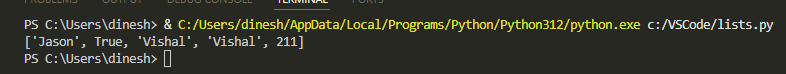

### Access List Item

List items are ordered and accessed through their index number. Index number starts from 0.

The following code is printing the second item in the list. Each item can be accessed through the index number.

```python
departments = ["Finance", "Administration", "IT", "Marketing", "Engineering"]
print (departments[1])
```

Output:

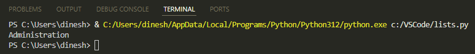

### Change List Item

This code is changing the second item to *Legal*:

```python
departments = ["Finance", "Administration", "IT", "Marketing", "Engineering"]
departments[1] = "Legal"
print (departments)
```

Output:

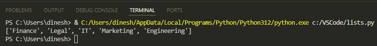

### Add or Remove List Item

This code is using the *append* method to add an item to the list:

```python
departments = ["Finance", "Administration", "IT", "Marketing", "Engineering"]
departments.append("Procurement")
print (departments)
```

Output:

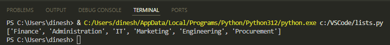

To remove an item from the list, you can use the *remove* method. For example: `colors.remove(“green”)`*.*

### Sort List Items

This code is sorting the list in ascending alphabetical order:

```python
departments = ["Finance", "Administration", "IT", "Marketing", "Engineering"]
departments.sort()
print (departments)
```

Output:

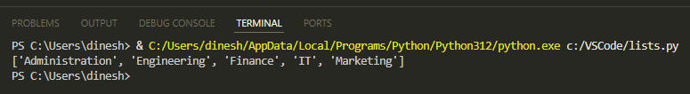

## Dictionaries

A dictionary stores items in *key: value* format. Keys must be unique, although values can be duplicates. Dictionary items are ordered and changeable.

Dictionary is written with curly brackets { }.

Here's a dictionary:

```python
a_dict = {
    "integer": 112,
    "boolean": True,
    "string": "Jane",
    "duplicate_int": 112,
}
print(a_dict)
```

Run the code and you'll see this output:

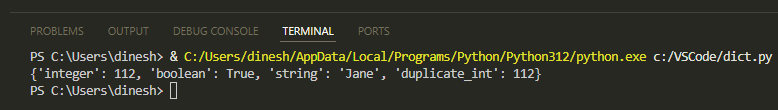

### Get a Dictionary Value

This code prints the value for the key *Fred*:

```python
teacher_subject = {
    "Jaya": "Cellular biology",
    "Shriya": "Chemistry",
    "Jane": "Genetics",
    "Fred": "Physics",
    "John": "Astronomy",
}
print(teacher_subject ["Fred"])
```

Output:

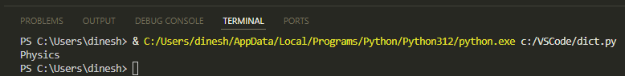

Alternatively, you can use the *get* method to get the value:

```python
teacher_subject = {
    "Jaya": "Cellular biology",
    "Shriya": "Chemistry",
    "Jane": "Genetics",
    "Fred": "Physics",
    "John": "Astronomy",
}
print(teacher_subject.get("Fred"))
```

### Change a Dictionary Value

This code changes the value for the key *Jaya*:

```python
teacher_subject = {
    "Jaya": "Cellular biology",
    "Shriya": "Chemistry",
    "Jane": "Genetics",
    "Fred": "Physics",
    "John": "Astronomy",
}
teacher_subject ["Jaya"] = "Immunology"
print(teacher_subject)
```

Output:

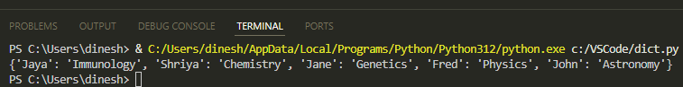

### Add a Dictionary Item

This can be done by adding a new key and its value:

```python
teacher_subject = {
    "Jaya": "Cellular biology",
    "Shriya": "Chemistry",
    "Jane": "Genetics",
}
teacher_subject ["Sujith"] = "Biochemistry"
print(teacher_subject)
```

Output:

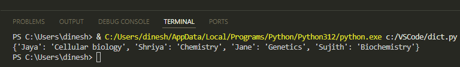

### Remove a Dictionary Item

This can be done by using the *pop* method:

```python
teacher_subject = {
    "Jaya": "Cellular biology",
    "Shriya": "Chemistry",
    "Jane": "Genetics",
    "Sujith": "Biochemistry",
}
print(teacher_subject) #print before removal
teacher_subject.pop("Sujith")
print(teacher_subject) #print after removal
```

Output:

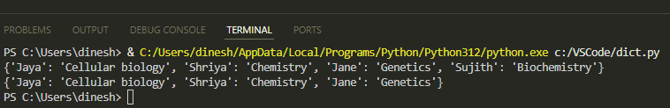

## Tuples

A tuple, like a list variable, can store multiple items. In a list, you can add, remove, and modify items. In contrast, once a tuple is created, you cannot change items in the tuple or add or remove items.

Tuples are generally faster than list because of their read-only nature.

Tuple is written with parenthesis ( ) and can contain duplicates.

Here's a tuple:

```python
a_tuple = (211, "Anita", True, 3.14, 211) 
print(a_tuple)
```

Run the code and you'll see this output:

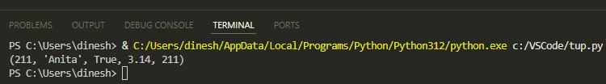

### Access a Tuple Item

Tuple items are ordered, and you can access them using an index number.

This code will print the fourth item in the tuple:

```python
departments = ("Finance", "Administration", "IT", "Marketing", "Engineering")
print (departments[3])
```

Output:

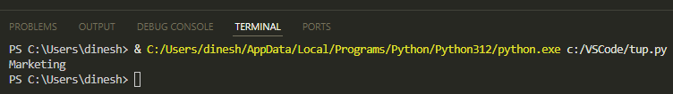

### Access a Range of Tuple Items

You can access a range of tuple items by using a colon.

This code selects the items from 1 to 3 index numbers:

```python
departments = ("Finance", "Admin", "IT", "Marketing", "Engineering", "Legal")
print (departments[1:4])
```

> 💡 **Tip:** Note that with <code>[1:4]</code>, the selection starts at the start index and goes up to but doesn't include the end index. That means it includes indices 1, 2, and 3 but doesn't include 4.

Output:

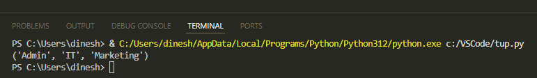

This code selects items from *Marketing* to the end:

```python
departments = ("Finance", "Admin", "IT", "Marketing", "Engineering", "Legal")
print (departments[3:])
```

Output:

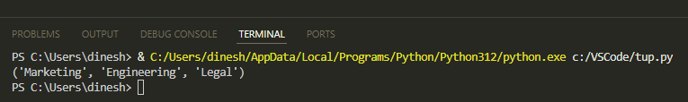

This code selects items from the beginning to *IT*:

```python
departments = ("Finance", "Admin", "IT", "Marketing", "Engineering", "Legal")
print (departments[:3])
```

> 💡 **Tip:** It includes start index (which is 0) but doesn't include end index (which is 3).

Output:

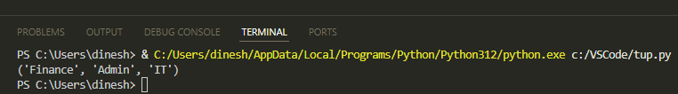

## Sets

A set can also have multiple items, but they cannot be duplicates. You cannot change the set items but can add or remove items.

A set is written with curly brackets { }.

Here's a set:

```python
a_set = {"Jane", 311, 7.14, True}
print(a_set)
```

When I run the code, I get this output:

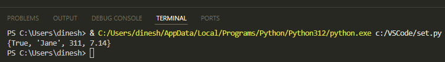

Sets are unordered. So, again when I run the code, the order of items changes.

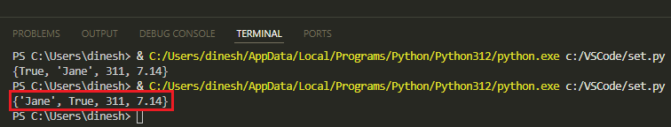

### Add or Remove a Set Item

This code adds an item using the *add* method:

```python
departments = {"Finance", "Engineering", "IT", "Marketing"}
departments.add("Quality Control")
print (departments)
```

Output:

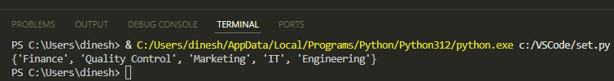

To remove an item from a set, you can use the *remove* method. For example: `colors.remove(“green”)`.

### Join Sets

Use the | operator to join sets:

```python
departments_set1 = {"Finance", "Engineering"}
departments_set2 = {"Marketing", "Legal"}
departments_set3 = {"Procurement", "Logistics"}
combined_set = departments_set1 | departments_set2 | departments_set3
print (combined_set)
```

Output:

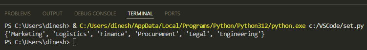

### Difference

You can use the *difference* method to return only those items in the first set that aren't there in the other set.

In this code, the *difference* method will return *Legal* and *IT* that aren't there in the other set:

```python
departments_set1 = {"Finance", "Marketing", "Legal", "IT"}
departments_set2 = {"Finance", "Logistics", "Marketing"}
set3 = departments_set1.difference(departments_set2)
print (set3)
```

Output:

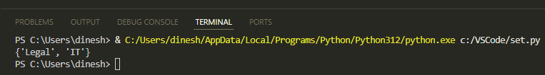

### Difference Update

You can use *difference\_update* method to retain only those items in the first set that aren't there in the other set.

In this code, the *difference\_update* method updates first set with *Legal* and *IT*:

```python
departments_set1 = {"Finance", "Marketing", "Legal", "IT"}
departments_set2 = {"Finance", "Logistics", "Marketing"}
departments_set1.difference_update(departments_set2)
print (departments_set1)
```

Output:

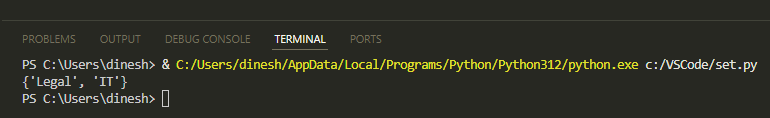

### Symmetric Difference

You can use *symmetric\_difference* method to return items that are in one of the sets but not in both:

```python
departments_set1 = {"Finance", "Marketing", "Legal", "IT"}
departments_set2 = {"Finance", "Logistics", "Marketing"}
set3 = departments_set1.symmetric_difference(departments_set2)
print (set3)
```

Output:

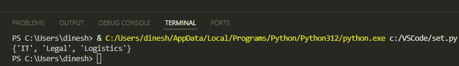

## Convert One Data Structure into Another

There could be use cases where you want to convert one data structure into another. Let's cover few such cases.

### List to a Tuple

For example, to make the data unchangeable, you might want to convert a list to a tuple:

```python
a_list = ["Astronomy", 211, 71.1, "History"]
print (a_list)
a_tuple = tuple(a_list)
print (a_tuple)
```

Output:

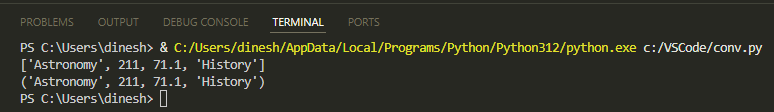

### List to a Set

For example, to remove duplicates, you might want to convert a list to a set:

```python
a_list = ["Astronomy", 211, 71.1, "History", "History", 211]
print (a_list)
a_set = set(a_list)
print (a_set)
```

Output:

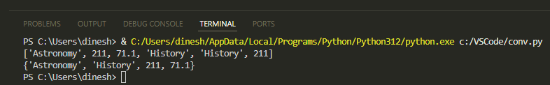

### Dictionary to a Tuple

For example, to have the *key: value* items become unchangeable, you might want to convert a dictionary to a tuple:

```python
a_dict = {"Astronomy": 1, "History": 2}
print (a_dict)
a_tuple = tuple(a_dict.items())
print (a_tuple)
```

Output:

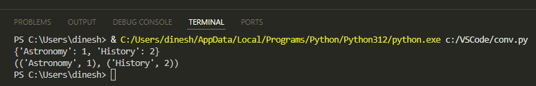

### Tuple to a List

For example, to add an item, you might want to convert a tuple to a list:

```python
a_tuple = ("Astronomy", "History", 211, 312)
print (a_tuple)
a_list = list(a_tuple)
a_list.append("Philosophy")
print (a_list)
```

Output:

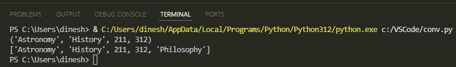

In this document, we've looked at the data structures in Python: lists, dictionaries, tuples, and sets. Each of these data structures has unique features. Lists provide ordered, changeable data; dictionaries provide key-value pair storage; tuples provide unchangeable data; and sets provide unique, unordered data.