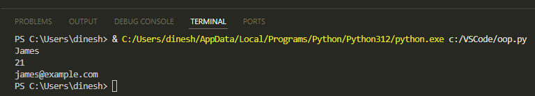
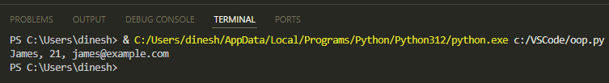
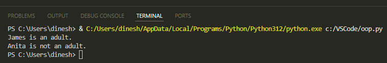
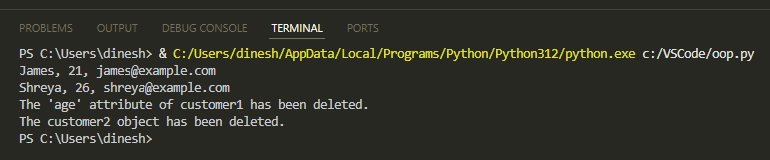
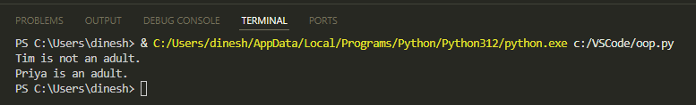
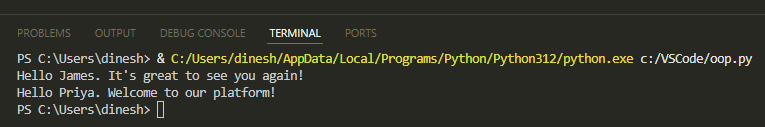
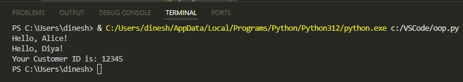

# Classes and Objects in Python

This document will help you understand Python classes, objects, inheritance, and polymorphism.

---
## Create a Class and its Object

A class defines a set of attributes and methods that its objects can use. A class is like a blueprint for creating objects.

The following code:

* Creates a class named `Customer` with customer attributes: name, age, and email address.
    
* Creates an instance of the `Customer` class named `customer1`*;* it means `customer1` is the object of the `Customer` class.
    
* Prints the attributes of the `customer1` object.
    

```python
class Customer:
    # Initializer / Instance attributes
    def __init__(instance, name, age, email):
        instance.name = name
        instance.age = age
        instance.email = email
# Create an object customer1
customer1  = Customer("James", 21, "james@example.com")
# Print values of the customer1 object's attributes
print(customer1.name)
print(customer1.age)
print(customer1.email)
```

The code uses the `init` method to assign values to attributes when the object is being created. The first parameter is `instance` that represents the instance of the class and allows you to access the class's attributes and methods. You can name this parameter anything like *myobject*.

Run the code and you'll see this output:



## String Representation of the Object

In this code, we use the `str` method to give a string representation of the object:

```python
class Customer:
    # Initializer / Instance Attributes
    def __init__(instance, name, age, email):
        instance.name = name
        instance.age = age
        instance.email = email
    def __str__(instance): 
        return f"{ instance.name}, {instance.age}, { instance.email}"
# Create an object customer1
customer1  = Customer("James", 21, "james@example.com")
# Print the customer1 object
print(customer1)
```

When `print(customer1)` is called, the `str` method is invoked.

Run the code to see this output:



## Add a Method to the Class to Handle Specific Functionality

Let's have a method in the class that checks whether the customer is an adult. In the following example, the `is_adult` method checks whether the customer is 18 years or older and then prints a message indicating that the customer is adult.

```python
class Customer:
    def __init__(instance, name, age, email):
        instance.name = name
        instance.age = age
        instance.email = email
    # Method to check if the customer is an adult
    def is_adult(instance): 
        if instance.age >= 18: 
            print(instance.name + " is an adult.") 
        else: 
            print(instance.name + " is not an adult.")
customer1  = Customer("James", 19, "james@example.com")
customer2  = Customer("Anita", 17, "anitha@example.com")
# Check if the customers are adults
customer1.is_adult()
customer2.is_adult()
```

Output:



## Del Keyword

To delete the attributes of objects or the object itself, use the `del` keyword.

In this example, we delete the `customer1` age and then delete the `customer2` object. We use the `try… except…` blocks to catch exceptions that occur when the attribute or object isn't found after deletion and print an error message.

```python
class Customer:
    def __init__(instance, name, age, email):
        instance.name = name
        instance.age = age
        instance.email = email
    def __str__(instance): 
        return f"{ instance.name}, {instance.age}, { instance.email}"
customer1  = Customer("James", 21, "james@example.com")
customer2  = Customer("Shreya", 26, "shreya@example.com")

# Print both objects once before deletion.
print(customer1)
print(customer2)

# Delete the age attribute of customer1 object.
del customer1.age

# Try to print customer1 age. This will raise an AttributeError exception.
try: 
    print(customer1.age) 
except AttributeError: 
    print("The 'age' attribute of customer1 has been deleted.")

# Delete the customer2 object.
del customer2

# Try to print customer2. This will raise a NameError exception.
try: 
    print(customer2) 
except NameError: 
    print("The customer2 object has been deleted.")
```

Output:



## Inheritance

With inheritance, a child class can inherit the method and attributes of the parent class.

As shown in the following code, when you create the `NewCustomer` class as a child of the `Customer` class, it will inherit all the attributes and methods from the `Customer` class, including the `is_adult` method and the attributes name, age, and email. When you create an instance of `NewCustomer`*,* you can call the `isAdult` method to check if the customer is an adult. The code also uses the `pass` keyword to indicate that the child class isn’t adding any method or attributes to itself.

```python
class Customer:
    def __init__(instance, name, age, email):
        instance.name = name
        instance.age = age
        instance.email = email
    # Method to check if the customer is an adult
    def is_adult(instance): 
        if instance.age >= 18: 
            print(instance.name + " is an adult.") 
        else: 
            print(instance.name + " is not an adult.")
# Child class
class NewCustomer(Customer):
    pass
new_customer1 = NewCustomer("Tim", 16, "tim@example.com")
new_customer2 = NewCustomer("Priya", 20, "priya@example.com")
# Check if the new customers are adults
new_customer1.is_adult()
new_customer2.is_adult()
```

Output:



## Method Overriding and Polymorphism

When the child class wants a specific implementation of an inherited method, it can override the method.

In the following code, `greet_customer` method is overridden in the `NewCustomer` class to provide a different greeting message. Objects of both classes call this method to display a different message depending on whether the customer is an existing one or a new one. It also shows *polymorphism* where the same method name has different forms of implementation.

```python
class Customer:
    def __init__(instance, name):
        instance.name = name
    # Method to greet customer
    def greet_customer(instance): 
        print("Hello " + instance.name + ". It's great to see you again!")

# Child class
class NewCustomer(Customer):
    # Overriding the greet_customer method from the Customer class
    def greet_customer(instance): 
        print("Hello " + instance.name + ". Welcome to our platform!")

customer1  = Customer("James")
new_customer1 = NewCustomer("Priya")

# Calling the method from the Customer class
customer1.greet_customer()
# Calling the overridden method from the NewCustomer class
new_customer1.greet_customer()
```

Output:



## Super Function

We can use the `super` function to invoke methods in the parent class.

In the following example, `super` is used for calling `init` method of the parent class to set the customer's name. Then, `super` is again used for calling the `get_greeting` method of parent class to greet the customer. The child class also adds its own message to the overridden method.

```python
# Parent class
class Customer:
    def __init__(instance, name):
        instance.name = name

    def get_greeting(instance):
        print("Hello, " + instance.name + "!")

# Child class inheriting from Customer
class NewCustomer(Customer):
    def __init__(instance, name, customer_id):
        super().__init__(name)  # Call the __init__ method of the parent class
        instance.customer_id = customer_id  # Additional attribute for NewCustomer

    def get_greeting(instance):
        super().get_greeting() # Call the parent class's greeting method
        print("Your Customer ID is: " + str(instance.customer_id))

customer = Customer("Alice")
new_customer = NewCustomer("Diya", 12345)
customer.get_greeting()    
new_customer.get_greeting()
```

Output:



This document discussed the basic foundation of object-oriented programming, including classes, objects, inheritance, polymorphism, and method overriding. We also covered how to delete objects and attributes that can aid in memory management and the use of the `super` function for calling the parent class methods.
