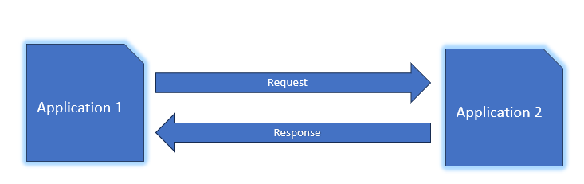
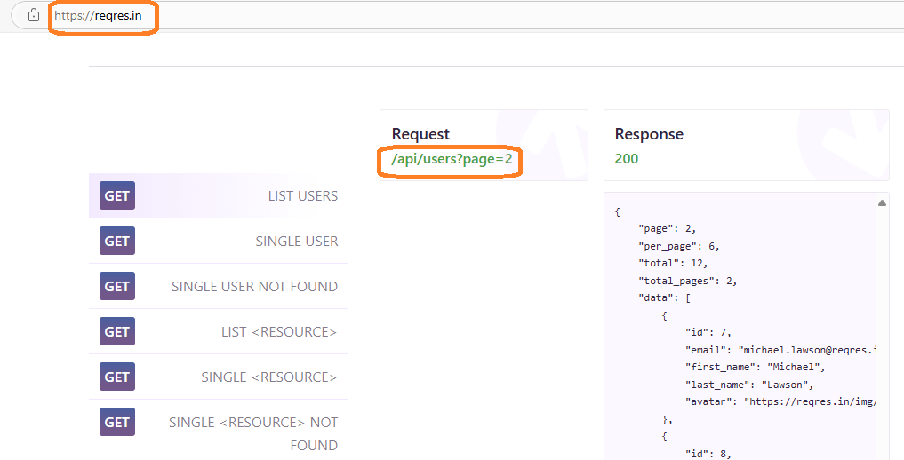
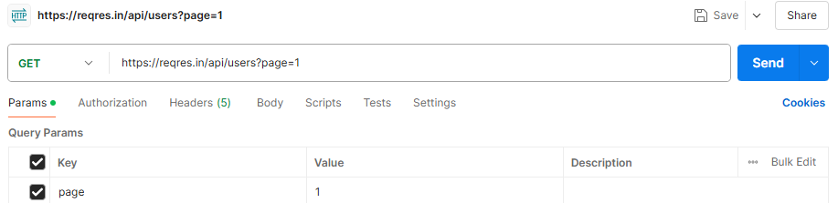
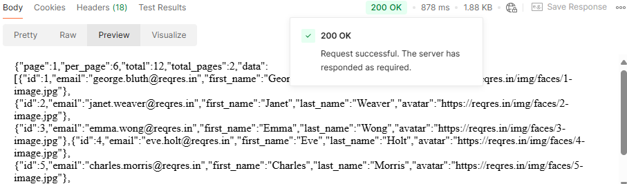
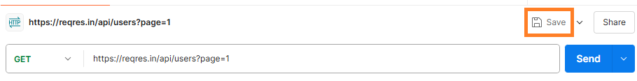
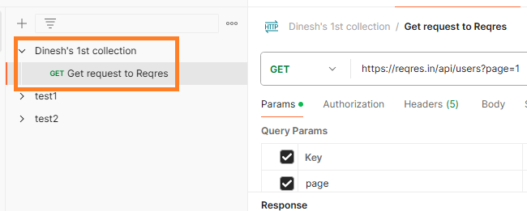

# Introduction to Postman

## What’s Postman?

Postman is a tool for creating, testing, and using APIs.

## What’s API?

API (Application Programming Interface) enables different applications to talk to each other. This happens through a request and response mechanism.

## Sample API

To interact with an API, we'll use Reqres API. Reqres API is a mock API for experimenting and testing.

The API endpoint highlighted in the screenshot is for fetching user data. Think of an endpoint as the location your application visits to get this data.

## GET Request

A GET request is how one application asks another application for information. For instance, Application 1 might ask Application 2 for a list of users. Application 2 processes this request and sends back the data.

## Send a GET Request

Let's now send a GET request to the Reqres API to retrieve information about users.

Step 1: Open Postman and click the + sign to select a new request.

Step 2: In the text box adjacent to GET, enter the Reqres endpoint URL `https://reqres.in/api/users?page=1`.

Note the page parameter is *1*. When handling APIs that return large sets of data, pagination helps break down the data into manageable chunks. Many APIs provide query parameters to go through pages, like `?page=1`, `?page=2`.

Step 3: Click **Send**.

Step 4: When you click **Send**, Postman responds with a 200 OK status and displays the response from the Reqres API. The response contains details of users such as first name and last name of users.

Step 5: To save this request to a collection, click **Save**. In Postman we can group requests into collections.

Step 6: Name the request.

Step 7: Save the request in an existing collection or create a new collection.

Step 8: After saving the request, it appears in the collection for easy access and future use.

Congrats! You’ve learned the basics of Postman: what it is, sending GET requests, and creating collections.
