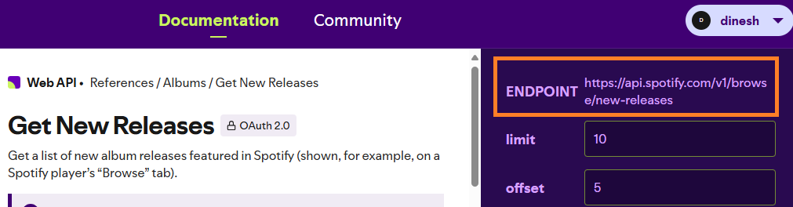
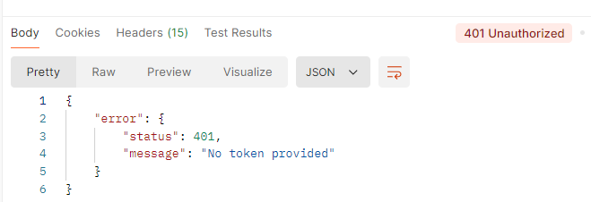

# Postman: Obtaining Authorization

This document explains how to use Postman to connect to the Spotify API. We'll walk through the process of obtaining authorization and making authenticated API requests to Spotify.

---
## 401 Unauthorized: Why Authorization is Essential

Spotify implements the OAuth 2.0 authorization framework. With OAuth 2.0, an application first retrieves an access token for the API, then uses that token to authenticate subsequent requests.

Let's see what happens when we send a request to Spotify without setting up authorization.

1 Copy an endpoint from the [Spotify doc](https://developer.spotify.com/documentation/web-api).

2 Open the Postman desktop app, paste the endpoint for GET, and click **Send**.

When we click Send, we see a 401 Unauthorized error as the response. That means the request isn't authorized to use Spotify API.

Let's look at how to obtain authorization from Spotify.

## Create an App on Spotify

1 Once you've signed up for a Spotify Developer account, go to the Dashboard and click **Create app**.

2 Enter the app name and description.

3 Enter redirect URL. This is the URL where users can be redirected after authentication. It's also known as callback URL. As you'll see later on, we'll need to enter this URL in Postman as callback URL.

I'm using the Postman desktop app, so I entered the localhost URL for callback. 

If you're using Postman online, refer to the authorization topic of the [Postman doc](https://learning.postman.com/) to find out the callback URL you should be using.

4 Click **Save**.

5 After save, click **Settings** of the app to copy client ID and secret. We'll use this ID and secret in Postman for configuring the authorization settings.

## Configure Authorization Settings

1 Open Postman. Create a new collection.

2 Name the collection. For example, I named it *Spotify*.

3 Click the **Authorization** tab and select *OAuth 2.0* as authorization type.

Next, we'll configure the new access token in the same **Authorization** tab.

4 Leave the default value of grant type as *Authorization Code*.

5 Enter callback URL as the same URL you entered in the Spotify app.

6 Enter the Auth URL as `https://accounts.spotify.com/authorize`*.* This is the authorization server's URL. You can find this URL in the [Spotify doc](https://developer.spotify.com/documentation/web-api).

7 Enter the access token URL as `https://accounts.spotify.com/api/token`. You can find this URL in the [Spotify doc](https://developer.spotify.com/documentation/web-api).

8 Enter your Spotify app's client ID and secret. Postman suggests using variables to store these values to keep the sensitive data secure.

9 Enter the scope of values you're requesting. For example, I entered *playlist-read-private playlist-modify-private.* You can find the list of acceptable scope values in the [Spotify doc](https://developer.spotify.com/documentation/web-api).

10 Click **Save**.

11 Scroll to the bottom of the page and click **Get New Access Token**.

12 Spotify will ask you to sign in. After signing in, you'll see the terms and conditions. Click **Agree** to proceed.

13 When you click **Agree**, a token is automatically generated. You can change the name of the token or use the default name. Click **Use Token** to set this token to be used for all requests in your collection.

## Send an API Request

Now that we've got the access token, let's send a request.

1 Copy the endpoint of a request from the [Spotify doc](https://developer.spotify.com/documentation/web-api). For this example, we'll copy `https://api.spotify.com/v1/browse/new-releases`.

2 Create a new request in the Spotify collection and paste the endpoint for GET.

3 Click **Send**.

4 When you click Send, Postman displays the response from Spotify, indicating that the authorization setup is working.

You did it! You've now learned how to configure authorization in Postman, and tested that your setup is working correctly.