# Postman: Sending Requests
In the [previous document](../doc6/Postman_Obtain_Auth.md){target="_blank"}, we used Postman to complete the authorization process to gain access to the Spotify service and used the GET method to retrieve data. In this document, we'll extend our knowledge by examining the POST, PUT, and DELETE methods to interact with the Spotify service more comprehensively.

---

## Send a POST Request

Let's start with sending a POST request to create a playlist.

1 In the [Spotify doc](https://developer.spotify.com/documentation/web-api), go to the Create Playlist topic and copy the endpoint URL.

2 Open the Postman desktop app. We already created the *Spotify* collection in the previous tutorial. In the Spotify collection, add a new request.

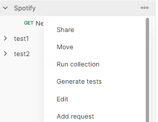

3 Give a name to the request. For instance, *Create my playlist*.

4 Select POST and paste the endpoint URL you copied from the Spotify doc. You’ll need to replace `{user_id}` with the username from Spotify.

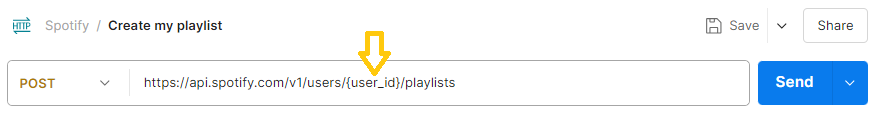

5 Go to your account in the [Spotify Web Player](https://open.spotify.com/), then click **Edit profile**, and copy the username value.

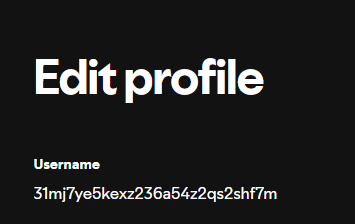

6 In Postman, replace the `{user_id}` value of the URL with the copied username. We can use a variable to store that username. Select the pasted username, then click **Set as variable**, and choose **Set as new variable**. Name the variable, for example, *username,* and set the scope of the variable as *Collection.* Finally, click **Set variable**. The endpoint will now have the variable in place of `{user_id}`.

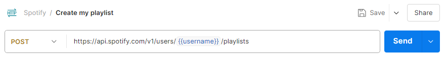

7 The body of the POST request should contain the data to be created. In the [Spotify doc](https://developer.spotify.com/documentation/web-api), go to the Create Playlist topic, copy the request body. Note that in request body *false* means the playlist will be private.

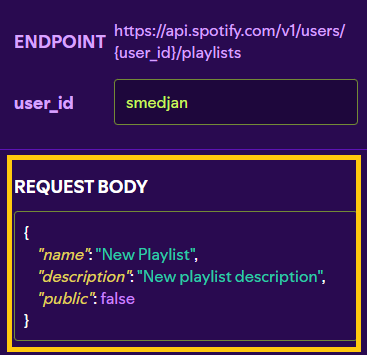

8 In Postman, click **Body**, and then **raw**. Paste the request body. I edited the copied request body to give a name to the playlist and a description.

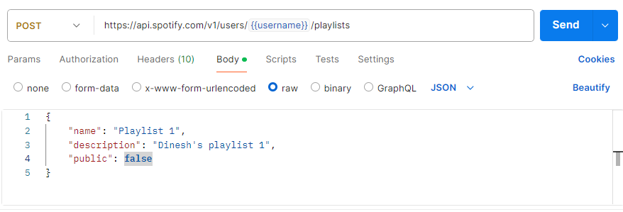

9 Click **Send**.

When you click send, you'll see *Status 201* appear. This status means the playlist was successfully created. Go ahead and copy the playlist ID from the response - we'll need it for the next step.

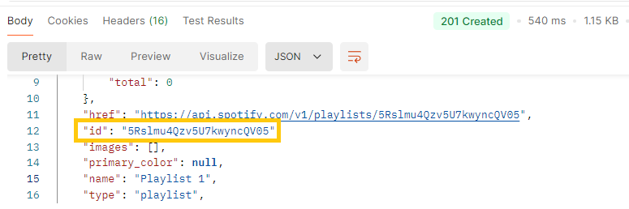

You should now see your new playlist in your Spotify account as well.

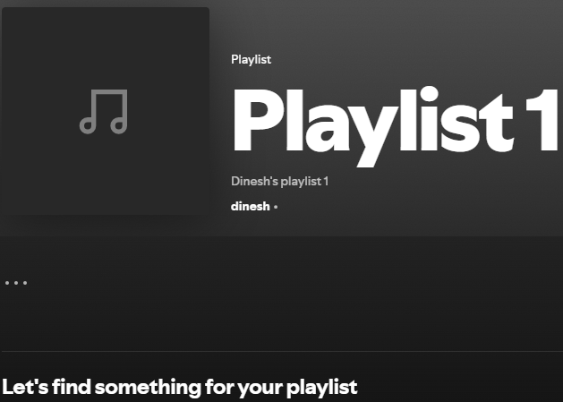

Next, we'll add a couple of songs to the playlist.

1 In the [Spotify doc](https://developer.spotify.com/documentation/web-api), go to the Add Items to Playlist topic and copy the endpoint URL.

2 In the *Spotify* collection of Postman, add a new request. Name the request. For instance, *Add songs to my playlist*.

3 Select POST and paste the endpoint URL you copied from the Spotify doc.

4 In the endpoint URL, replace `{playlist_id}` with the ID of the playlist you just created. We'll use a variable like we used earlier for the username. Select the pasted playlist ID, then click **Set as variable**, followed by **Set as new variable**. Give the variable a name, for example, *playlistID*. Set the scope of the variable as *Collection* and click **Set variable**. The endpoint will now have the variable in place of `{playlist_id}`.

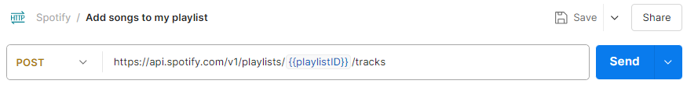

5 In the [Spotify doc](https://developer.spotify.com/documentation/web-api), go to the Add Items to Playlist topic and copy the example of the request body.

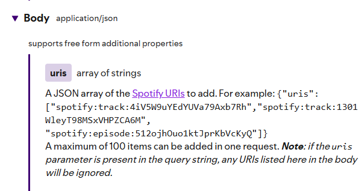

6 In Postman, click **Body** and then **raw**. Then, paste the request body. I edited the copied request body to add two songs of my choice to the playlist.

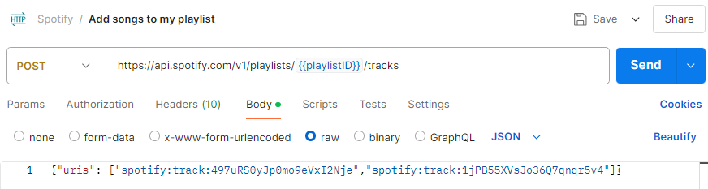

You can find the track ID within the URL of the song on Spotify. For example, if the URL is `https://open.spotify.com/track/2va1fTXhffQcr6TfPGf16y`, the track ID would be `2va1fTXhffQcr6TfPGf16y`.

7 Click **Send**.

When you click send, you’ll see *Status 201* appear. This status means the songs were successfully added to the playlist. Spotify returns the snapshot ID of the playlist's current state.

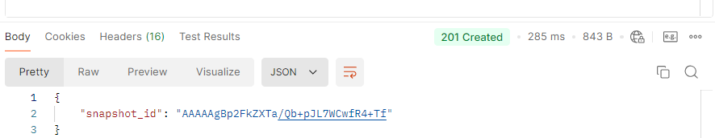

You should now see the songs added to your playlist in your Spotify account as well.

## Send a PUT Request

We'll now use the PUT request to replace the two existing songs in the playlist with two new songs.

1 In the [Spotify doc](https://developer.spotify.com/documentation/web-api), go to the Update Playlist Items topic and copy the endpoint URL.

2 In the *Spotify* collection of Postman, add a new request. Give a name to the request. For instance, *Update my playlist*.

3 Select PUT and paste the endpoint URL you copied from the Spotify doc.

4 In the endpoint URL, replace `{playlist_id}` with the actual ID of the playlist. As we did previously for adding songs, we'll use the variable `playlistID`.

5 Copy the example of the URI array request body from the Spotify doc.

6 In Postman, click **Body**, and then **raw**. Then, paste the request body. I edited the request body to add the two songs of my choice to the playlist.

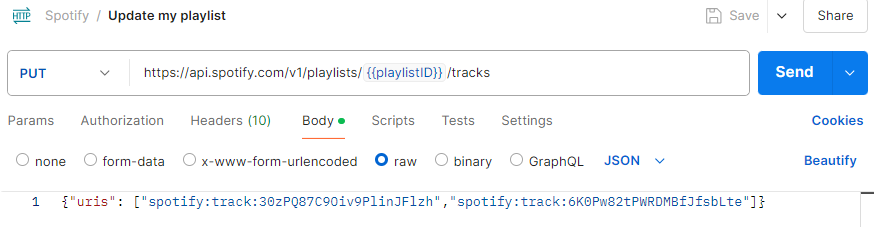

7 Click **Send**.

When you click send, you'll see *Status 200* appear. This status means the songs were successfully added to the playlist, replacing the earlier songs. Spotify returns the snapshot ID of the playlist's current state.

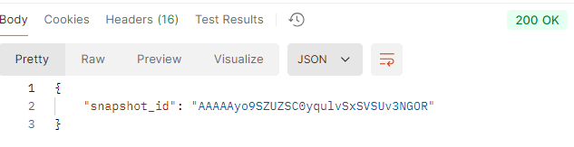

You should now see your updated playlist in your Spotify account as well.

## Send a DELETE Request

Let's now use the DELETE request to delete a song from the playlist.

1 In the [Spotify doc](https://developer.spotify.com/documentation/web-api), go to the Remove Playlist Items topic and copy the endpoint URL.

2 In the *Spotify* collection of Postman, add a new request. Give a name to the request. For instance, *Delete from my playlist*.

3 Select DELETE and paste the endpoint URL you copied from the Spotify doc.

4 In the endpoint URL, replace `{playlist_id}` with the actual ID of the playlist. As we did previously for adding songs, we'll use the variable `playlistID`.

5 Copy the example of the URI array request body from the Spotify doc.

6 In Postman, click **Body**, and then **raw**. Then, paste the request body. I edited the request body to specify the one song that will be deleted from the playlist.

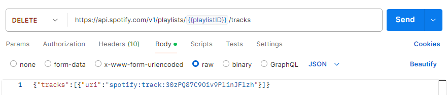

7 Click **Send**.

When you click send, you'll see *Status 200* appear. This status means the song was successfully deleted from the playlist. Spotify returns the snapshot ID of the playlist's current state.

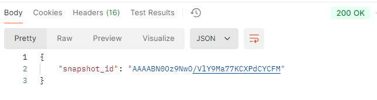

You should now see your updated playlist in your Spotify account as well. The playlist will no longer include the song we just deleted.

In this document, we covered how to use POST, PUT, and DELETE requests with the Spotify API and Postman. We added songs to a playlist with a POST request, updated the playlist with new songs using a PUT request, and deleted a song with a DELETE request. By referencing the Spotify documentation, we learned how to construct our request bodies and understood the endpoints necessary for these operations. This hands-on experience should give you a good understanding of working with APIs.
