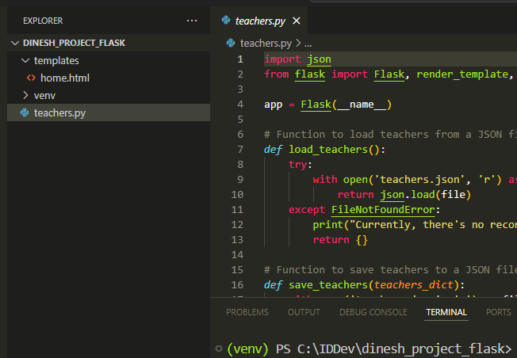
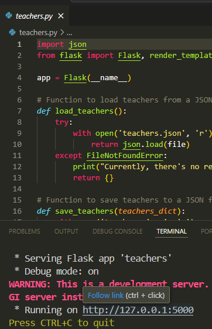
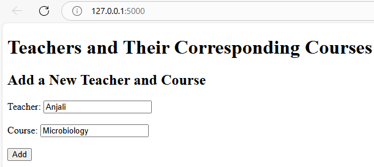
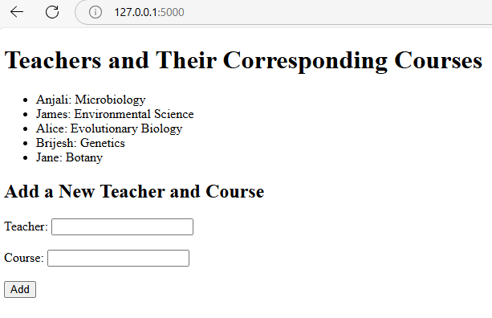
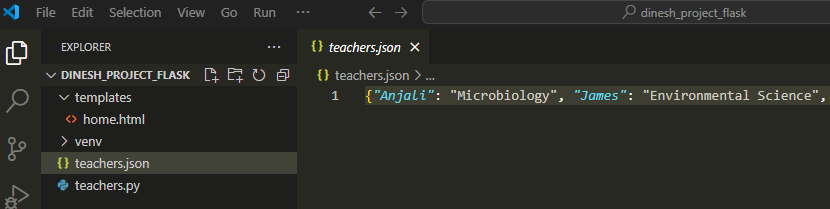

# Getting Started with Flask: Building a Dynamic Web Page
Flask is a Python framework to create web applications. In this guide, we will explore how to build a dynamic web page using Flask.

---

## Set Up the Flask Environment in Windows

Step 1: Open the terminal in Visual Studio Code and type: `python -m venv venv`

This creates a virtual environment. Using virtual environments ensures that the dependencies for one project don't interfere with the dependencies of other projects.

Step 2: Activate the virtual environment: `venv\Scripts\activate`

Step 3: Install Flask: `pip install Flask`

## Create the Flask Application

To illustrate how to make a web page dynamic, we'll create a Flask application that will collect teacher and course names from users and display these names. The application stores this information in a JSON file.

Step 1: Create a file named `teachers.py`.

Step 2: Import necessary components and create an instance of the Flask class:

```python
import json
from flask import Flask, render_template, request

app = Flask(__name__)
```

* We’ve imported Python's built-in `json` module, which is used for working with JSON (JavaScript Object Notation) data. JSON is a common data format used for transmitting data, especially in web applications. We’re also importing the Flask class that’s used to create a Flask application.
    
* `render_template` is a Flask function for working with HTML templates. Flask allows you to use templates (usually `.html` files) to dynamically generate HTML by passing data to them.
    
* `request` is used to access incoming HTTP request data in Flask. When a user submits data through a form, the `request` object provides access to the data.
    
* `app = Flask(__name__)`: Initializes the Flask application.
    

Step 3: Define the load and save functions for teacher names and their corresponding courses:

```python
# Function to load teacher and course names from a JSON file
def load_teachers():
    try:
        with open('teachers.json', 'r') as file:
            return json.load(file)
    except FileNotFoundError:
        print("Currently, there's no record for teachers and their courses.")
        return {}

# Function to save teacher and course names to a JSON file
def save_teachers(teachers_dict):
    with open('teachers.json', 'w') as file:
        json.dump(teachers_dict, file)

# Load initial data
teachers_dict = load_teachers()
```

* When the Flask application is launched, `load_teachers()` is called to read the data from the `teachers.json` file and store it in the `teachers_dict` dictionary.
    
* When a user submits the form (POST request), the `save_teachers(teachers_dict)` function is called to save the updated data to the `teachers.json` file. If the JSON file doesn't exist, the function creates it.
    

Step 4: Define the route and handle the HTML form submission:

```python
@app.route('/', methods=['GET', 'POST'])
def home():
    if request.method == 'POST':
        teacher = request.form['teacher']
        course = request.form['course']
        teachers_dict[teacher] = course
        save_teachers(teachers_dict)
    return render_template('home.html', teachers=teachers_dict)
```

* `'/'` in `@app.route('/', methods=['GET', 'POST'])` indicates the root URL. For example, when the user accesses the page using `http://127.0.0.1:5000`, the root URL is accessed. When the user accesses the root URL, the `home` function is triggered. `methods=['GET', 'POST']` specifies that the route can handle both GET and POST HTTP methods.
    
* When a user submits the form (POST request), the `save_teachers(teachers_dict)` function is called to save the updated data to the `teachers.json` file.
    
* The `render_template('home.html', teachers=teachers_dict)` function displays the HTML page that the user sees when accessing the root URL (GET request). The function populates the `teachers` variable in the HTML template with the dictionary data from `teachers_dict`. `teachers_dict` contains the data that the `load_teachers()` function retrieves from the JSON file.

Step 5: Run the application when the `teachers.py` file is run:

```python
if __name__ == '__main__':
    app.run(debug=True)
```

This will run the application locally in the Flask development server with the debug mode on. When you run a Python file directly, the special built-in variable `__name__` is set to `'__main__'`.

## Create the HTML File

Create a `templates` directory. Then, create`home.html` inside this directory with this code:

```xml
<!DOCTYPE html>
<html lang="en">
<head>
    <meta charset="UTF-8">
    <title>Teachers and Courses</title>
</head>
<body>
    <h1>Teachers and Their Corresponding Courses</h1>
    <ul>
    
        <li>{{ teacher }}: {{ course }}</li>
    
    </ul>

    <h2>Add a New Teacher and Course</h2>
    <form method="POST">
        <label for="teacher">Teacher:</label>
        <input type="text" id="teacher" name="teacher" required>
        <br><br>
        <label for="course">Course:</label>
        <input type="text" id="course" name="course" required>
        <br><br>
        <button type="submit">Add</button>
    </form>
</body>
</html>
```

* The for loop iterates over the `teachers` dictionary and displays each teacher and their corresponding course in a list format.
    
* `teachers.items()` returns all key-value pairs (teacher-course pairs) from the `teachers` dictionary.
    
* `teacher` represents the key (teacher's name), and `course` represents the value (course name).
    

## Run the Application

Take a look at the directory structure in the Explorer pane. This is what the files look like, with the HTML file located in the `templates` folder:



Now, let's run the application.

Step 1: Click **Run** for `teachers.py`.

Step 2: Your application should now be running on `http://127.0.0.1:5000/`.

In the terminal, press `Ctrl` and click the link to open the web page:



Step 3: Enter the teacher's name and the corresponding course. Once you fill in both fields, click **Add**.



Step 4: Keep adding more records. As you add them, the records will appear on the page:



Even if you stop the server and run the Python file again to start the server, the previously added records will still be displayed on the page. This is because we're storing them in the JSON file that was created and updated by the `save_teachers` function. You can check the JSON file by clicking on it in the Explorer pane:



Congratulations! You've learned how to build a dynamic web page using Flask. We created a Python file that allows users to add teacher and course names, stored the added information in a JSON file for data persistence, and displayed the added information on the page.