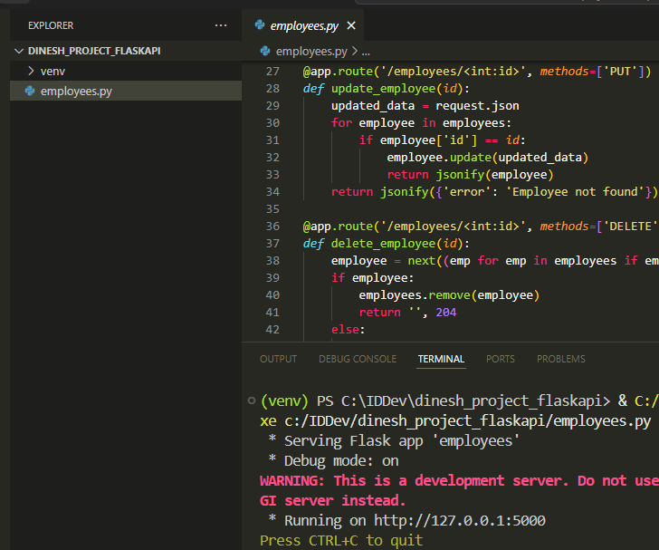
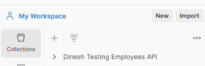
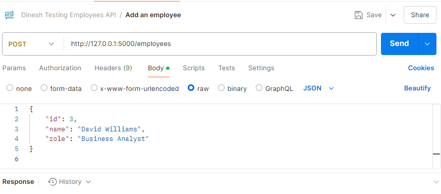
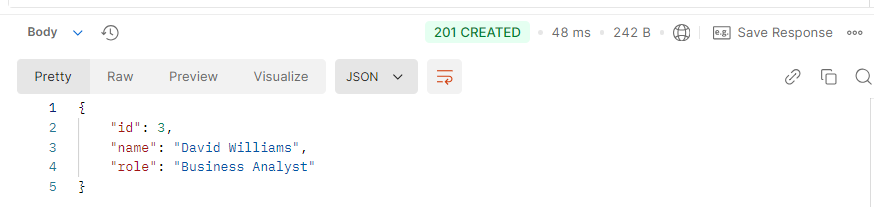
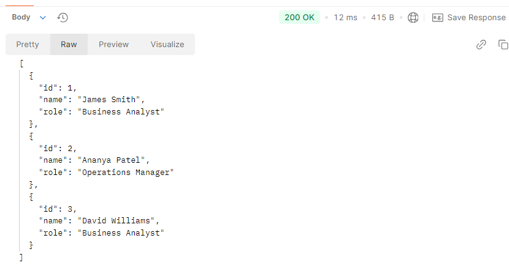
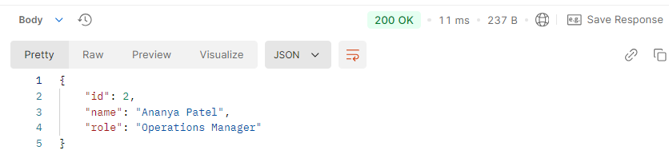
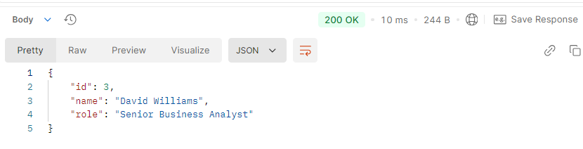
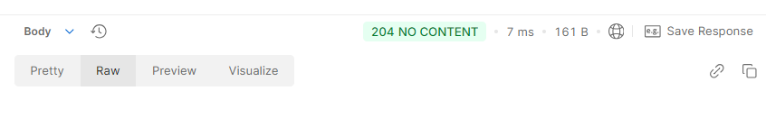

# Building Your First REST API Using Flask

Flask is a Python web framework. In this walkthrough, we'll create a basic REST API to manage a list of employees. We'll cover the following operations:

* **GET** requests to retrieve employee information
    
* **POST** requests to add new employees
    
* **PUT** requests to update existing employee details
    
* **DELETE** requests to remove employees from the list
    

By following along, we'll discover the fundamental techniques for creating an API using Flask, including handling HTTP requests and responses, and creating endpoints.

---

## Set Up the Flask Environment in Windows

<span class="step-number">1</span> Open the terminal in Visual Studio Code and type: `python -m venv venv`

This creates a virtual environment. Using virtual environments ensures that the dependencies for one project don't interfere with the dependencies of other projects.

<span class="step-number">2</span> Activate the virtual environment: `venv\Scripts\activate`

<span class="step-number">3</span> Install Flask: `pip install Flask`

## Create the Flask Application

<span class="step-number">1</span> Create a file named `employees.py`.

<span class="step-number">2</span> Import necessary components and create an instance of the Flask class:

```python
from flask import Flask, request, jsonify

app = Flask(__name__)
```

* **Flask** is the main class for creating a Flask application.
    
* **request** object handles incoming HTTP requests, such as GET and POST.
    
* **jsonify** function converts Python dictionaries into JSON responses. We will see later that each employee item will be stored as a dictionary and sent as a JSON response.
    

`app = Flask(__name__)` creates an instance of the Flask class, initializing a new Flask application.

<span class="step-number">3</span> Define the data structure for storing employee data:

```python
employees = [
    {'id': 1, 'name': 'James Smith', 'role': 'Business Analyst'},
    {'id': 2, 'name': 'Ananya Patel', 'role': 'Operations Manager'}
]
```

Here, we define a list of dictionaries, where each dictionary represents an employee.

<span class="step-number">4</span> Create an API endpoint for adding a new employee (POST):

```python
@app.route('/employees', methods=['POST'])
def add_employee():
    new_employee = request.json
    employees.append(new_employee)
    return jsonify(new_employee), 201
```

The `def add_employee()` function is run when a POST request is made to the `/employees` endpoint. The function takes the new employee data from the request, adds it to the `employees` list, and returns the new employee data in JSON format with a `201 Created` status code.

<span class="step-number">5</span> Create an API endpoint for getting all employees (GET):

```python
@app.route('/employees', methods=['GET'])
def get_employees():
    return jsonify(employees)
```

The function returns the list of all employees.

<span class="step-number">6</span> Create an API endpoint for getting a specific employee (GET):

```python
@app.route('/employees/<int:id>', methods=['GET'])
def get_employee(id):
    for employee in employees:
        if employee['id'] == id:
            return jsonify(employee)
    return jsonify({'error': 'Employee not found'}), 404
```

The `<int:id>` part of the route means that the endpoint expects an integer as part of the URL. The integer represents the employee's ID.

Flask extracts the `id` value from the URL and passes it to the `get_employee(id)` function. For example, if the endpoint is [`http://localhost:5000/employees/2`](http://localhost:5000/employees/2), Flask assigns `2` to the variable `id` and calls the function with `id` set to `2`.

The function uses a *for* loop to check if an `id` matches the `id` provided through the URL. If a match is found, the function returns the employee's data in JSON format using `jsonify(employee)`. If no matching employee is found, the function returns a JSON response with an error message and a `404 Not Found` status.

<span class="step-number">7</span> Create an API endpoint for updating a specific employee (PUT):

```python
@app.route('/employees/<int:id>', methods=['PUT'])
def update_employee(id):
    updated_data = request.json
    for employee in employees:
        if employee['id'] == id:
            employee.update(updated_data)
            return jsonify(employee)
    return jsonify({'error': 'Employee not found'}), 404
```

Flask extracts the `id` value from the URL and passes it to the `update_employee(id)` function.

The function uses a for loop to check if an `id` matches the `id` provided through the URL. If a match is found, the function updates the employee data and returns the updated data in JSON format using `jsonify(employee)`. If no matching employee is found, the function returns a JSON response with an error message and a `404 Not Found` status.

<span class="step-number">8</span> Create an API endpoint for deleting a specific employee (DELETE):

```python
@app.route('/employees/<int:id>', methods=['DELETE'])
def delete_employee(id):
    employee = next((emp for emp in employees if emp['id'] == id), None)
    if employee:
        employees.remove(employee)
        return '', 204
    else:
        return jsonify({'error': 'Employee not found'}), 404
```

Flask extracts the `id` value from the URL and passes it to the `delete_employee(id)` function.

This line `employee = next((emp for emp in employees if emp['id'] == id), None)` uses a generator expression to find the first employee in the `employees` list whose `id` matches the given `id`. If a matching employee is found, it's assigned to the `employee` variable. If no match is found, `employee` is set to `None`.

If a matching employee is found, it's removed from the `employees` list using the `remove` method.

The function then returns an empty response body with a `204 No Content` status code, indicating that the deletion was successful.

<span class="step-number">9</span> Run the application when the `employees.py` file is run:

```python
if __name__ == '__main__':
    app.run(debug=True)
```

This ensures that the Flask application runs with debugging enabled when you execute `employees.py` directly.

## Run the Application

On Visual Studio Code, click **Run** for `employees.py` to run the Flask application. This will launch the server locally on 127.0.0.1, usually port 5000:



## Interact with the Flask Employees API

Once the server is up and running, you can use tools like Postman, cURL, or any other API testing tool to test the endpoints for adding, retrieving, updating, and deleting employee data.

We'll use Postman for this walkthrough.

### Sending a POST Request to Add a New Employee

<span class="step-number">1</span> In Postman, create a new request. You can group all your requests in a collection. For example, I created a collection specific for the Employees API called *Dinesh Testing Employees API*:



<span class="step-number">2</span> Select the POST method from the dropdown menu.

<span class="step-number">3</span> Enter the endpoint URL. For example, `http://127.0.0.1:5000/employees`.

<span class="step-number">4</span> Click on the **Body** tab.

<span class="step-number">5</span> Select the **raw** radio button.

<span class="step-number">6</span> Choose **JSON** from the dropdown menu next to the **raw** radio button.

<span class="step-number">7</span> Enter the request body in JSON format. Here's an example of what the body might look like:

```json
{
    "id": 3,
    "name": "David Williams",
    "role": "Business Analyst"
}
```

<span class="step-number">8</span> Click **Send** to submit the request:



You will get a response in the response pane, showing the newly added employee's data and a `201 Created` status code:



### Sending a GET Request to Retrieve All Employees

<span class="step-number">1</span> Create a new request.

<span class="step-number">2</span> Select the GET method from the dropdown menu.

<span class="step-number">3</span> Enter the endpoint URL. For example, `http://127.0.0.1:5000/employees`.

<span class="step-number">4</span> Click **Send**.

You will get a response showing the data of all the employees and a `200 OK` status code:



### Sending a GET Request to Retrieve a Specific Employee

<span class="step-number">1</span> Create a new request.

<span class="step-number">2</span> Select the GET method from the dropdown menu.

<span class="step-number">3</span> Enter the endpoint URL. In this case, we'll enter an endpoint URL with a specific employee ID. For example, `http://127.0.0.1:5000/employees/2`.

<span class="step-number">4</span> Click **Send**.

You will get a response showing the data of the employee who has an ID of 2 and a `200 OK` status code:



### Sending a PUT Request to Update an Employee's Information

<span class="step-number">1</span> Create a new request.

<span class="step-number">2</span> Select the PUT method from the dropdown menu.

<span class="step-number">3</span> Enter the endpoint URL. In this case, we'll enter an endpoint URL with a specific employee ID. For example, `http://127.0.0.1:5000/employees/3`.

<span class="step-number">4</span> Click on the **Body** tab.

<span class="step-number">5</span> Select the **raw** radio button.

<span class="step-number">6</span> Choose **JSON** from the dropdown menu next to the **raw** radio button.

<span class="step-number">7</span> Enter the request body in JSON format. Here's an example of what the body might look like:

```json
{
  "id": 3,
  "name": "David Williams",
  "role": "Senior Business Analyst"
}
```

We're changing the role from *Business Analyst* to *Senior Business Analyst.*

<span class="step-number">8</span> Click **Send**.

You should receive a response with the updated employee data and a `200 OK` response code:



### Sending a DELETE Request to Remove an Employee

<span class="step-number">1</span> Create a new request.

<span class="step-number">2</span> Select the DELETE method from the dropdown menu.

<span class="step-number">3</span> Enter the endpoint URL. In this case, we'll enter an endpoint URL with a specific employee ID. For example, `http://127.0.0.1:5000/employees/3`.

<span class="step-number">4</span> Click **Send**.

Upon deletion, you should receive a response with no content and a `204 No Content` status code:



Congratulations! By following this walkthrough, we successfully created an Employees API using Flask. By handling GET, POST, PUT, and DELETE requests, this API adheres to the principles of RESTful web services.